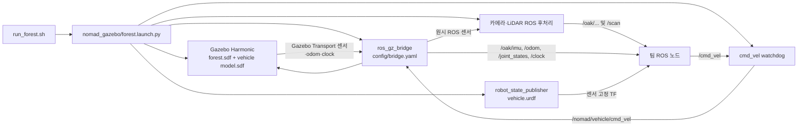

# NOMAD ROS 2 워크스페이스 — 팀 AI 작업 지침

현재 기본 환경은 Ubuntu 24.04 + ROS 2 Jazzy + Gazebo Harmonic 8이다. `src/nomad_gazebo`가 실행 패키지이며 `src/mvsim`, `src/nomad_sim`은 이전 MVSim 구현과 맵 원본을 보존한다. 이 저장소 전체가 colcon 워크스페이스이고 기본 위치는 `~/nomad_ws`다. 외부 컴퓨터의 절대 경로를 코드에 고정하지 말고 패키지 share 디렉터리를 사용한다.

## 기본 명령과 경계

```bash
cd ~/nomad_ws
./.nomad/build.sh
./run_forest.sh
```

`run_forest.sh`는 `.nomad/env.sh`를 내부에서 읽고 `nomad_gazebo/forest.launch.py`를 실행한다. 다른 터미널의 ROS 노드는 별도로 `source ~/nomad_ws/.nomad/env.sh`가 필요하다. `ROS_DOMAIN_ID=42`, `ROS_AUTOMATIC_DISCOVERY_RANGE=LOCALHOST`, `GZ_PARTITION=nomad_gazebo_42`가 기본값이다. 모든 시뮬레이션 시간 소비 노드는 `use_sim_time=true`를 쓴다. 같은 domain/partition에 두 번째 Gazebo를 띄워 첫 실행과 섞지 않는다. 사용자 세션을 임의 종료하거나 위치를 초기화하지 않는다.

수동 조종은 `ros2 run nomad_gazebo teleop.py`로 뜨는 Qt 창에서 한다. `W/S`는 목표 속도를 0.1 m/s씩 조절하고 `A/D`는 키를 누르는 동안만 회전 명령을 낸다. 키를 떼면 회전 명령이 중앙으로 복귀한다. 포커스를 잃거나 `Space`를 누르면 속도·조향을 0으로 만든다. 이 UI는 `/cmd_vel`을 발행하며, 실제 차량 구동계 모델이 아니다. `python3-pyqt5`가 런타임 의존성이다.

설치 요청이면 `README.md`의 빌드·실행 절차까지만 수행한다. 기능 개발이면 변경 경계에 맞는 최소 검증을 한다. `build/`, `install/`, `log/`는 생성물이며 Git에서 제외한다. `src/nomad_sim/assets/forest/`와 이전 소스는 삭제하지 않는다.

## 패키지·파일 구조

| 경로 | 역할 |
|---|---|
| `src/nomad_gazebo/worlds/forest.sdf` | 기본 숲 월드, 동일 배치의 `forest_bare.sdf`는 무식생 성능 비교용 |
| `src/nomad_gazebo/assets/authoring/` | 현재 NOMAD 길·돌·벽·나무 배치와 높이/흙길 원본 스냅샷 |
| `src/nomad_gazebo/assets/geometry/` | 생성된 지면 시각/충돌 OBJ, 흙 텍스처, 묶인 식생 OBJ |
| `src/nomad_gazebo/models/nomad_vehicle/model.sdf` | 임시 Ackermann 차체·4개 바퀴·조향 관절·센서·Gazebo 시스템 |
| `src/nomad_gazebo/urdf/nomad_vehicle.urdf` | 동일 차량의 ROS 링크·관절·고정 센서 TF |
| `src/nomad_gazebo/config/sensors.yaml` | 임시 OAK-D Lite FF, YDLIDAR G2, OAK IMU 값 |
| `src/nomad_gazebo/config/bridge.yaml` | Gazebo Transport ↔ ROS 2 토픽 대응 |
| `src/nomad_gazebo/launch/forest.launch.py` | Gazebo, ros_gz_bridge, robot_state_publisher, 센서 후처리, 명령 watchdog |
| `src/nomad_gazebo/scripts/generate_world.py` | authoring 스냅샷 → 지형 메시·텍스처·월드 SDF |
| `src/nomad_gazebo/scripts/generate_vehicle.py` | 센서 YAML → 차량 SDF/URDF/메타데이터 |
| `src/nomad_sim/`, `src/mvsim/` | 이전 MVSim 코드와 현재 맵의 원본. 기본 Gazebo 빌드 대상 아님 |

생성된 SDF/URDF/OBJ만 손으로 고치면 다음 생성 때 사라진다. 지속적 변경은 생성기와 `config/sensors.yaml` 또는 `assets/authoring`에 넣고 다시 생성한다. `generate_world.py --map-package src/nomad_sim`은 MVSim 원본을 다시 들여오는 **의도적인 맵 동기화**에서만 쓴다. 우연히 재생성해서 기존 배치를 바꾸지 않는다.

## 실행·데이터 흐름



Gazebo는 ROS 노드가 아니다. `ros_gz_bridge`만 Gazebo Transport와 ROS 2 사이를 연결한다. `gazebo_sensor_adapter.py`와 `lidar_bridge.py`는 **ROS → ROS** 후처리다. 다른 팀 알고리즘은 별도 ROS 패키지에 둔다.

## 주요 ROS 계약

| 토픽 | 타입/의미 | frame/주의 |
|---|---|---|
| `/oak/rgb/image_raw` | `sensor_msgs/Image`, bgr8, 640×480 | `oak_rgb_optical_frame`; 30Hz 목표 |
| `/oak/depth/image_raw` | Image, 16UC1, mm | `oak_depth_optical_frame`; 스테레오 매칭이 아닌 RGBD 렌더 |
| `/oak/left/image_rect`, `/oak/right/image_rect` | Image, mono8, 640×480 | 각 optical frame; 임시 75mm baseline |
| `/oak/{rgb,depth,left,right}/camera_info` | `sensor_msgs/CameraInfo` | 실제 캘리브레이션 전 임시 pinhole 값 |
| `/oak/imu` | `sensor_msgs/Imu`, Gazebo 3축 각속도·3축 가속도 | `oak_imu_frame`; 200Hz 목표, 실제 칩 축·위치 미검증 |
| `/scan` | `sensor_msgs/LaserScan`, 360°·500점·10Hz | `scan`; 2D 단일 평면 GPU LiDAR |
| `/odom` | `nav_msgs/Odometry` | Gazebo의 3D ground truth, VINS 결과 아님 |
| `/joint_states`, `/tf`, `/tf_static`, `/clock` | 관절 상태, TF, 시뮬레이션 시계 | TF 발행자 중복 금지 |
| `/cmd_vel` | `geometry_msgs/Twist` | watchdog이 0.35초 무명령 시 정지; `linear.x`, `angular.z` 사용 |

Gazebo 원시 토픽은 `bridge.yaml`에서 `/nomad/raw/...`로 매핑한다. 카메라/스캔 최종 인터페이스는 후처리 노드에서 나온다. IMU는 `/oak/imu`로 직접 브리지된다. 센서 Hz는 모두 시뮬레이션 시간 기준이며 wall-clock 처리율과 다르다. 실제 장비의 영상 왜곡, LiDAR 순차 회전, IMU 축/노이즈를 완전 재현하지 않는다. OAK-D Lite 초기 Kickstarter 제품에는 IMU가 없을 수 있으므로 팀 실물 확인 전까지 가정으로 표기한다.

TF는 `robot_state_publisher`가 차량 링크·고정 센서 프레임을, Gazebo 3D odometry가 `odom → base_link`를 담당한다. Ackermann 플러그인의 별도 평면 `wheel_tf`와 `wheel_odom`은 브리지하지 않는다. VINS/SLAM이 `map → odom`이나 `odom → base_link`를 발행할 때는 기존 ground-truth TF와 충돌하지 않도록 설계를 분리한다. 카메라 optical 축은 +Z 전방, +X 오른쪽, +Y 아래; 차량 base는 +X 전방, +Y 왼쪽, +Z 위다.

## 맵과 물리의 현재 범위

현재 맵은 약 70×50m, 길 폭 약 3m, 최고 높이 2.4m다. 출발 후 첫 갈림길의 평지·오르막, 평지 쪽의 돌로 막힌 **계속 이어지는** 연결 길, 목적지 가까운 막다른 평지 길, 되돌아가 오르막으로 도착하는 관계를 유지한다. 길의 위치·높이·바위·벽은 현재 `nomad_sim` authored 맵에서 가져왔고, 바닥의 시각 팔레트만 논문 숲 장면을 참고한 마른 흙 톤이다. 지면 시각 메시와 충돌 메시의 높이는 동일하다. 흙길 색은 traversability 비용이나 마찰 입력이 아니다.

기본 숲 맵에서 현재 145그루가 보이고 그중 길 근처 20그루만 충돌체다. 나머지 나무와 풀은 시각용이다. 비도로를 막는 숨은 벽은 없다. 차량이 흙길을 우선할지, 막다른 길에서 복귀할지는 **팀 알고리즘의 과제**다.

블록형 Ackermann 차량은 임시 wheelbase 0.72m, track 0.60m, 바퀴 반경 0.15m, 총 질량 34.6kg이다. 4개 바퀴와 2개 앞 조향 관절이 있다. 서스펜션과 실측 질량/마찰 모델은 없다. Gazebo AckermannSteering은 속도 명령 기반이라 SDF의 `<effort>`만으로 모터 토크 상한, 페이로드별 등판 실패를 검증할 수 없다. 그 시험은 토크 제한 휠 제어기를 별도로 구현하고 평지/경사/페이로드 조건에서 실제 바퀴 토크·속도를 기록해야 한다. 완료했다고 가정하지 않는다.

## 변경 후 확인

월드 authoring이나 차량 입력을 의도적으로 바꾼 때만 각각 `scripts/generate_world.py`, `scripts/generate_vehicle.py`를 다시 실행한다. 그 후 `./.nomad/build.sh`로 Gazebo 패키지만 빌드하고 `./run_forest.sh`로 실행한다. 변경 범위에 맞는 정적/ROS 검사를 수행하되 설치만 요청받았을 때 전체 테스트를 추가하지 않는다. 사용 중인 Gazebo/MVSim을 자동 종료하지 않는다. 토픽·TF·차량 제약이 바뀌면 이 문서와 README를 같이 갱신한다.
