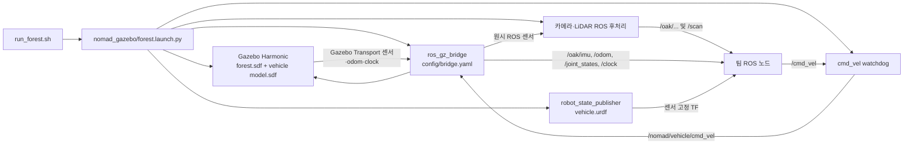

# NOMAD ROS 2 워크스페이스 — 팀 AI 작업 지침

## 모듈 분리 구조 (2026-10-02)

현재 자율주행은 인지 / VIO / Path Planning / Control로 분리했다. 이전 단일 planning 패키지 설명보다 이 절과 각 모듈 문서를 우선한다.

- [인지 입력·출력·교체](src/nomad_perception/README.md)
- [VIO 입력·출력·TF 소유권](src/nomad_vio/README.md)
- [Path Planning: GPP·LPP·후진 복구·명령 선택](src/nomad_path_planning/README.md)
- [Control: 속도·조향 명령 실행·실측 피드백](src/nomad_control/README.md)
- [공통 메시지](src/nomad_interfaces/README.md) / [전체 실행·통합 가이드](src/nomad_bringup/README.md)

토픽명은 `src/nomad_bringup/config/topics.yaml`, 교체 공급자는 `modules.yaml`, 공통 차량 기하는 `vehicle.yaml`에서 관리한다. YAML 수정 후 관련 노드를 재시작한다. 메시지 타입 변환에는 어댑터가 필요하다.

Planning은 `/nomad/planning/drive_command`의 `nomad_interfaces/msg/DriveCommand`로 목표 속도(m/s, 음수 후진)와 전륜 중심 조향각(rad, 양수 왼쪽), 유효기간과 정지 요청을 보낸다. Control은 `/nomad/control/vehicle_state`로 실측 피드백을 보낸다. 경로·지도·도착·후진 선택은 Planning에만 있다. 기본 Control의 `/cmd_vel`은 Gazebo용 내부 출력이다.

기본 VIO는 ground truth 어댑터이며 실제 VIO 추정기가 아니다. `vio: external`이면 `tf_owner: vio`를 함께 설정하고 Gazebo ground-truth 동적 TF를 끈다. 센서 정적 TF는 유지한다. 이미 실행 중인 사용자 시뮬레이션을 자동 종료/초기화하지 않는다.

빌드: `source .nomad/env.sh` 후 `colcon build --base-paths src --packages-up-to nomad_bringup nomad_gazebo --symlink-install`. 전체 실행은 기존 `./run_autonomy.sh`. 자세한 단독 실행 명령은 통합 가이드를 따른다.

개발 경계: 인지 알고리즘은 nomad_perception, VIO 대체는 nomad_vio, GPP/LPP/Recovery/명령 선택은 nomad_path_planning, 구동 변환은 nomad_control에 둔다. Planning에서 Twist/PWM을 직접 발행하지 않는다. Control은 Path/OccupancyGrid/목표를 구독하지 않는다. 인터페이스 변경 시 관련 모듈별 README와 nomad_interfaces 명세를 함께 갱신한다.

센서·terrain 매개변수는 `src/nomad_perception/config/parameters.yaml`로 이동했다. 기존 카메라 기반 주행 설정과 지도 비용 의미는 유지한다. 승인 목표는 Planning 입력 노드가 즉시 발행하고, 인지는 지도 확장 요청으로만 소비한다. 지도 밖 목표는 GPP가 확장 지도를 기다린다. 아래 과거 지도 확장/목표 전달 설명보다 이 규칙이 우선한다.


현재 기본 환경은 Ubuntu 24.04 + ROS 2 Jazzy + Gazebo Harmonic 8이다. `src/nomad_gazebo`가 실행 패키지이며 `src/mvsim`, `src/nomad_sim`은 이전 MVSim 구현과 맵 원본을 보존한다. 이 저장소 전체가 colcon 워크스페이스이고 기본 위치는 `~/nomad_ws`다. 외부 컴퓨터의 절대 경로를 코드에 고정하지 말고 패키지 share 디렉터리를 사용한다.

## 기본 명령과 경계

```bash
cd ~/nomad_ws
./.nomad/build.sh
./run_forest.sh
```

`run_forest.sh`는 `.nomad/env.sh`를 내부에서 읽고 `nomad_gazebo/forest.launch.py`를 실행한다. 다른 터미널의 ROS 노드는 별도로 `source ~/nomad_ws/.nomad/env.sh`가 필요하다. `ROS_DOMAIN_ID=42`, `ROS_AUTOMATIC_DISCOVERY_RANGE=LOCALHOST`, 시뮬레이터 실행 시 `GZ_PARTITION=nomad_gazebo_<hostname>_42`, `GZ_IP=127.0.0.1`을 기본으로 적용한다. `.nomad/env.sh`만 읽는 터미널의 partition 기본값과는 구분한다. 모든 시뮬레이션 시간 소비 노드는 `use_sim_time=true`를 쓴다. 같은 domain/partition에 두 번째 Gazebo를 띄워 첫 실행과 섞지 않는다. 사용자 세션을 임의 종료하거나 위치를 초기화하지 않는다.

수동 조종은 `./run_teleop.sh`로 뜨는 Qt 창에서 한다. 이 스크립트가 환경을 읽고 `ros2 run nomad_gazebo teleop.py`를 실행한다. `W/S`는 목표 속도를 0.1 m/s씩 조절하고 `A/D`는 키를 누르는 동안만 회전 명령을 낸다. 키를 떼면 회전 명령이 중앙으로 복귀한다. 포커스를 잃거나 `Space`를 누르면 속도·조향을 0으로 만든다. 이 UI는 `/cmd_vel`을 발행하며, 실제 차량 구동계 모델이 아니다. `python3-pyqt5`가 런타임 의존성이다.

설치 요청이면 `README.md`의 빌드·실행 절차까지만 수행한다. 기능 개발이면 변경 경계에 맞는 최소 검증을 한다. `build/`, `install/`, `log/`는 생성물이며 Git에서 제외한다. `src/nomad_sim/assets/forest/`와 이전 소스는 삭제하지 않는다.

## 패키지·파일 구조

| 경로 | 역할 |
|---|---|
| `src/nomad_gazebo/worlds/forest.sdf` | 기본 숲 월드, 동일 배치의 `forest_bare.sdf`는 무식생 성능 비교용 |
| `src/nomad_gazebo/assets/authoring/` | 현재 NOMAD 길·돌·벽·나무 배치와 높이/흙길 원본 스냅샷 |
| `src/nomad_gazebo/assets/geometry/` | 생성된 지면 시각/충돌 OBJ, 흙 텍스처, 묶인 식생 OBJ |
| `src/nomad_gazebo/models/nomad_vehicle/model.sdf` | 임시 Ackermann 차체·4개 바퀴·조향 관절·센서·Gazebo 시스템 |
| `src/nomad_gazebo/urdf/nomad_vehicle.urdf` | 동일 차량의 ROS 링크·관절·고정 센서 TF |
| `src/nomad_gazebo/config/sensors.yaml` | 임시 OAK-D Lite FF, YDLIDAR G2, OAK IMU 값 |
| `src/nomad_gazebo/config/bridge.yaml` | Gazebo Transport ↔ ROS 2 토픽 대응 |
| `src/nomad_gazebo/launch/forest.launch.py` | Gazebo, ros_gz_bridge, robot_state_publisher, 센서 후처리, 명령 watchdog |
| `src/nomad_gazebo/scripts/generate_world.py` | authoring 스냅샷 → 지형 메시·텍스처·월드 SDF |
| `src/nomad_gazebo/scripts/generate_vehicle.py` | 센서 YAML → 차량 SDF/URDF/메타데이터 |
| `src/nomad_sim/`, `src/mvsim/` | 이전 MVSim 코드와 현재 맵의 원본. 기본 Gazebo 빌드 대상 아님 |

생성된 SDF/URDF/OBJ만 손으로 고치면 다음 생성 때 사라진다. 지속적 변경은 생성기와 `config/sensors.yaml` 또는 `assets/authoring`에 넣고 다시 생성한다. `generate_world.py --map-package src/nomad_sim`은 MVSim 원본을 다시 들여오는 **의도적인 맵 동기화**에서만 쓴다. 우연히 재생성해서 기존 배치를 바꾸지 않는다.

## 실행·데이터 흐름



Gazebo는 ROS 노드가 아니다. `ros_gz_bridge`만 Gazebo Transport와 ROS 2 사이를 연결한다. `gazebo_sensor_adapter.py`와 `lidar_bridge.py`는 **ROS → ROS** 후처리다. 다른 팀 알고리즘은 별도 ROS 패키지에 둔다.

## 주요 ROS 계약

| 토픽 | 타입/의미 | frame/주의 |
|---|---|---|
| `/oak/rgb/image_raw` | `sensor_msgs/Image`, bgr8, 640×480 | `oak_rgb_optical_frame`; 30Hz 목표 |
| `/oak/depth/image_raw` | Image, 16UC1, mm | `oak_depth_optical_frame`; 스테레오 매칭이 아닌 RGBD 렌더 |
| `/oak/left/image_rect`, `/oak/right/image_rect` | Image, mono8, 640×480 | 각 optical frame; 임시 75mm baseline |
| `/oak/{rgb,depth,left,right}/camera_info` | `sensor_msgs/CameraInfo` | 실제 캘리브레이션 전 임시 pinhole 값 |
| `/oak/imu` | `sensor_msgs/Imu`, Gazebo 3축 각속도·3축 가속도 | `oak_imu_frame`; 200Hz 목표, 실제 칩 축·위치 미검증 |
| `/scan` | `sensor_msgs/LaserScan`, 360°·500점·10Hz | `scan`; 2D 단일 평면 GPU LiDAR |
| `/odom` | `nav_msgs/Odometry` | Gazebo의 3D ground truth, VINS 결과 아님 |
| `/joint_states`, `/tf`, `/tf_static`, `/clock` | 관절 상태, TF, 시뮬레이션 시계 | TF 발행자 중복 금지 |
| `/cmd_vel` | `geometry_msgs/Twist` | watchdog이 0.35초 무명령 시 정지; `linear.x`, `angular.z` 사용 |

Gazebo 원시 토픽은 `bridge.yaml`에서 `/nomad/raw/...`로 매핑한다. 카메라/스캔 최종 인터페이스는 후처리 노드에서 나온다. IMU는 `/oak/imu`로 직접 브리지된다. 센서 Hz는 모두 시뮬레이션 시간 기준이며 wall-clock 처리율과 다르다. 실제 장비의 영상 왜곡, LiDAR 순차 회전, IMU 축/노이즈를 완전 재현하지 않는다. OAK-D Lite 초기 Kickstarter 제품에는 IMU가 없을 수 있으므로 팀 실물 확인 전까지 가정으로 표기한다.

TF는 `robot_state_publisher`가 차량 링크·고정 센서 프레임을, Gazebo 3D odometry가 `odom → base_link`를 담당한다. Ackermann 플러그인의 별도 평면 `wheel_tf`와 `wheel_odom`은 브리지하지 않는다. VINS/SLAM이 `map → odom`이나 `odom → base_link`를 발행할 때는 기존 ground-truth TF와 충돌하지 않도록 설계를 분리한다. 카메라 optical 축은 +Z 전방, +X 오른쪽, +Y 아래; 차량 base는 +X 전방, +Y 왼쪽, +Z 위다.

## 맵과 물리의 현재 범위

현재 맵은 약 70×50m, 원본 경로 폭 약 3m이며 뒤쪽 고지대 약 4m와 최대 ±0.325m 굴곡을 생성한다. 왼쪽 상승 구간은 약 7.8m, 오른쪽 약 22m다. 원본 PNG의 2.4m 높이는 참고 자료로만 보존하며 현재 물리 지면에 중첩하지 않는다. 출발 접지 구역은 평탄하다. 바닥은 Poly Haven CC0 흙/낙엽 사진을 혼합하며 도로 마스크를 표시하지 않는다. 지면 시각 메시와 충돌 메시의 높이는 동일하다. 작은 돌 260개와 가지는 `roadside_details.obj` 시각 메시이며 충돌체가 없다. 이전 돌 차단·벽·동굴·줄 형태 경계는 현재 월드에서 제외했고 경로 좌표만 배치 기준으로 유지한다. 높은 풀 벽 역시 시각용이므로 주행 불가 영역이나 완전한 막다른 길을 보장하지 않는다. 시각 재질은 traversability 비용이나 마찰 입력이 아니다.

기본 숲 맵에서 현재 363그루가 보이고 그중 길 근처 나무만 충돌체다. 나머지 나무와 풀은 시각용이다. 비도로를 막는 숨은 벽은 없다. 차량이 흙길을 우선할지, 막다른 길에서 복귀할지는 **팀 알고리즘의 과제**다.

블록형 Ackermann 차량은 임시 wheelbase 0.72m, track 0.60m, 바퀴 반경 0.15m, 총 질량 34.6kg이다. 4개 바퀴와 2개 앞 조향 관절이 있다. 서스펜션과 실측 질량/마찰 모델은 없다. Gazebo AckermannSteering은 속도 명령 기반이라 SDF의 `<effort>`만으로 모터 토크 상한, 페이로드별 등판 실패를 검증할 수 없다. 그 시험은 토크 제한 휠 제어기를 별도로 구현하고 평지/경사/페이로드 조건에서 실제 바퀴 토크·속도를 기록해야 한다. 완료했다고 가정하지 않는다.

## 변경 후 확인

월드 authoring이나 차량 입력을 의도적으로 바꾼 때만 각각 `scripts/generate_world.py`, `scripts/generate_vehicle.py`를 다시 실행한다. 그 후 `./.nomad/build.sh`로 Gazebo 패키지만 빌드하고 `./run_forest.sh`로 실행한다. 변경 범위에 맞는 정적/ROS 검사를 수행하되 설치만 요청받았을 때 전체 테스트를 추가하지 않는다. 사용 중인 Gazebo/MVSim을 자동 종료하지 않는다. 토픽·TF·차량 제약이 바뀌면 이 문서와 README를 같이 갱신한다.

## 전체 숲 밀도 2.5배 (2026-10-01)

방금 만든 국소 숲 영역과 이전 줄 형태의 경계는 기본 월드에서 제거했다. 기존 전체 맵 나무 145그루를 기준으로 2.5배를 올림해 363그루로 늘린다. 특정 영역을 막기 위한 줄/울타리/차단 배치는 만들지 않는다. 기존 145그루 위치는 유지하고 추가 218그루는 맵 전체에 불규칙하게 분포시킨다. 새 나무는 기존 경로 중심에서 최소 2.3m, 다른 줄기 중심에서 최소 1.1m 떨어뜨린다. 도로 색은 없다.

입력은 `assets/authoring/forest_density.json`이다. multiplier를 바꾸면 재생성할 수 있다. `assets/authoring/layout.json`은 145그루 원본으로 보존하고 `assets/authoring/forest_layout.json`은 밀도 증가 후 생성된 배치를 기록한다. 생성기는 항상 원본을 읽으므로 재생성할 때 2.5배가 누적되지 않는다. 가까운 나무만 기존 충돌 정책을 따르고 먼 나무는 묶인 시각 메시다. `vegetation:=False`에서는 전체 나무를 숨긴다. 전체 지형, 경사, 센서 설정은 바꾸지 않는다.

## 경로 풀 설정

`assets/authoring/path_grass.json`은 두 번째 갈림길 왼쪽 연결 경로 `rock_branch`의 길이 52.5% 지점에 높이 2.04~2.89m 풀을 벽처럼 배치한다. 길에 수직인 방향에서 +Z 기준 반시계 방향으로 yaw_offset_rad=0.3을 더하고 폭 7.5m, 두께 1.3m로 배치한다. 오른쪽이나 경로 전체를 높은 풀로 덮지 않는다. `path_grass.obj`는 해당 가로 풀 벽, `meadow_grass.obj`는 맵 전체에 약 3.4m 간격으로 놓인 높이 0.2~0.45m의 성긴 풀이다. 두 모델에는 visual만 있고 collision은 없다. 기존 지면 물리와 나무 배치는 바꾸지 않는다. 카메라와 렌더 기반 센서에는 보일 수 있으며 렌더링 비용은 발생한다. 무식생 월드에서는 둘 다 제외한다.

## 야지 계획 비용 (2026-10-01)

깊이 샘플 간격은 2픽셀이다. 누적 LiDAR 높이는 셀 내부 2cm XY 구간별 3D
최솟값/최댓값 상자로 보관해 반사가 128개를 넘었다고 폐기하지 않는다. 상자
모서리가 모두 지면과 일치할 때만 해제하며 돌출 물체의 높이를 평균내지 않는다.

확인된 지면은 `terrain.ground_memory_seconds: 10.0`초 동안 월드 좌표로 보관해
카메라 가장자리 이탈 뒤에도 LiDAR 반사 높이와 대조한다. 신선한 깊이 입력이
필수이며 새 불일치 관측/오류는 이전 증거를 폐기한다. 미관측 지면을 열지 않는다.

최신 기본 `terrain.objects_only: true`는 지면 형상의 위험 비용을 끄고 연결된
관측 지면보다 12cm 이상 돌출된 물체를 깊이 장애물로 판정한다. 지면 기준 없는
영역은 미확인으로 두며 LiDAR 장애물/팽창은 유지한다. 잡초는 기존 RGB-D 규칙을
사용한다. 아래 기존 거칠기·단차 비용 규칙은 objects_only=false에서만 적용한다.

현재 사용자 요청으로 `terrain.slope_enabled: false`, `tilt_guard_enabled: false`다.
경사 비용·경사 임계값 차단·지면 후보의 경사 탈락·차량/스캔 기울기 정지를 끈다.
아래 경사 기준은 다시 활성화할 때만 적용한다. 3D TF 보정, 거칠기·단차·고체
장애물과 기존 팽창은 유지한다. 변경은 계획 노드 재시작 후 적용된다.

`nomad_path_planning`의 기본 지형 모드는 `terrain.mode: geometry`다.
깊이 영상과 촬영 시각 TF로 관측 표면의 기울기·평면 잔차 거칠기·높이 불연속을
평가하고, 기준 초과 영역을 LiDAR 장애물과 함께 costmap에 차단 비용 100으로
추가한다. `/nomad/terrain_costmap`은 팽창 전 기하 비용/위험 영역이며,
`/nomad/terrain_labels`는 이전 colour 모드에서만 발행한다.
기본 기준 약 20°/RMS 4cm/잔차 범위 18cm는 실측 차량 한계가 아닌 초기값이다.
설정과 관측 누락·식생·낙차 등의 한계는 `src/nomad_path_planning/README.md`를 따른다.
월드·차량·센서 생성 입력은 이 변경으로 수정하지 않는다.

풀 처리: `terrain.grass_enabled`는 정렬 RGB-D에서 관측 지면 위 4~60cm의
낮은 녹색 식생을 반복 확인하는 초기 휴리스틱이다. 확인된 풀만 지면 잔차에서
제외하고, 최근 3D 관측과 일치하는 LiDAR 끝점을 통과 가능으로 처리한다.
카메라 밖/높은 풀은 구분하지 못한다. 시뮬레이터의 풀을 숨기거나 센서 마스크로
제외하지 않으며, 장애물 여유 반경 0.70m도 유지한다. 세부 조건과 한계는 계획 README 참조.

## 출발점 오른쪽 풀 한 포기 제거 (2026-10-01)

사용자 요청으로 낮은 풀 중심 `(-30.654947, -18.369343)` 한 포기만 제거했다.
`assets/authoring/path_grass.json`의 `background_exclusions`에 반경 0.1m의
생성 제외 항목을 기록한다. 모든 난수 배치 생성 후 제외하므로 다른 풀 위치는
변하지 않는다. 낮은 풀은 300개에서 299개이며 나무·높은 풀·지형·차량은 유지한다.
통과 영역 costmap 예외는 사용하지 않는다. 기존 Gazebo 세션은 재시작해야 반영된다.

시작 방향은 `assets/authoring/spawn_pose.json`의 `yaw_rad`에서 설정한다.
현재 값은 0.8267518515rad(약 47.37°)로, 요청 당시 차량 방향에서 왼쪽으로 90°
회전한 값이다. 시작 위치 `(-30, -18, 0.03)`은 유지하며 재실행부터 적용된다.

계획기의 `terrain.ground_filter_enabled`는 깊이 관측에서 접지 기준과 연결된
완만한 지면을 추정해 일치하는 LiDAR 지면 반사만 자유 끝점으로 누적한다.
지면 비용과 나머지 장애물은 유지하며 미관측을 열지 않는다. base_link 원점이
접지 기준이라는 차량 계약에 의존한다. 상세 관측/오차 조건은 계획 README 참조.

곡면의 지면 시작점은 가까운 직접 관측의 낮은 표면 띠에서 선택한다. 먼 접평면을
차량 위치로 외삽해 높이를 맞추지 않는다. 전진 LPP는 최대 1.5m이며 최종 목표가
가까우면 목표 거리로 후보 길이를 줄인다. 여유 반경과 목표 이전 충돌 검사는 유지한다.

## 자율주행 LiDAR 제외 (2026-10-02)

`navigation.lidar_enabled: false`가 기본이다. 기존 `/nomad/costmap`,
`/nomad/local_costmap`, `/nomad/observed_map`과 카메라 지형·기울기 계산은 유지한다.
GPP는 `/nomad/navigation_costmap`, LPP·제어·후진 복구는
`/nomad/navigation_local_costmap`을 쓴다. 두 주행 지도는 카메라로 장애물을 판정하며
LiDAR 장애물/팽창만 제외한다. 기존 LiDAR ray가 통과한 자유 공간은 유지해 카메라가
보지 못하는 차체 아래에서도 출발할 수 있게 한다. LiDAR 반사 셀은 카메라 지면
확인 전까지 미관측이며 반사 뒤는 열지 않는다. 물체 팽창 0.70m, 지역 자유 공간
2초 제한과 미관측 차단은 유지한다. depth/TF 오류·만료 시 주행 health는 false이며 scan은 필수가 아니다.
`true`로 설정하고 계획 노드를 재시작하면 기존 LiDAR 융합 주행으로 돌아간다.
LiDAR 장애물 제외 모드에는 geometry, ground_filter_enabled, objects_only가 필수다.
기존 slope_enabled=false와 objects_only=true는 유지하며 경사각 지도는 별도 발행하지 않는다.

센서 입력·health와 지도 계산은 별도 callback group 및 2-thread executor로
분리한다. 지도 갱신은 단일 작업만 담당한다. 영상/odom/scan DDS 대기열은 depth=1이다.
LiDAR 장애물 제외 모드의 health는 새 depth 입력 0.6초, 처리 완료 지도 2초(기존
local_max_age), 각각 wall-clock 3초를 확인한다. 계산 주기를 입력 수신 주기로
오인해 정지하지 않으며 새 영상만으로 오래된 지도의 유효 기간을 연장하지 않는다.

발행된 지도 안의 목표는 지도 계산 대기 없이 즉시 전달한다. 지도 확장 목표만
단일 지도 작업에서 처리하며 새 목표로 교체된 이전 요청은 발행하지 않는다.
LPP는 wall-clock 10Hz로 계산하되 궤적/신선도는 sim time을 유지한다.
GPP의 이전 목표 재시도 대기는 새 목표에 적용하지 않는다. 지면 반사 대조는
셀별로 묶어 처리하며 누적 높이 증거나 판정 조건을 생략하지 않는다.

## Fork2 연결길 경사 조정 (2026-10-02)

`assets/authoring/layout.json`의 `fork2_ramp`가 `rock_branch`에만 완만한 경사로를 적용한다. 기존 양 끝 높이 사이를 smoothstep으로 연결하고 중심 폭 4m, 양쪽 4m 전이 구간으로 주변 지형에 연결한다. 중심선 최대 경사는 약 45.3°에서 16.9°로 낮아진다. Fork1 주변 반경 10m와 급경사 구간의 높이는 그대로다. 지형 시각·충돌 메시와 나무 접지 높이를 함께 재생성한다. 등판 성공은 실제 주행으로 별도 확인한다.

## 맵 선택

기존 `./run_forest.sh` 실행 시 패키지 `maps/`의 목록에서 번호로 고른다. `maps/맵이름/map.json`과 `worlds/forest.sdf`, 상대 경로의 `assets/`, `models/`로 맵을 추가하면 목록에 자동 표시된다. 초기 등록: `01_original`(기존 급경사), `02_fork2_gentle`(Fork2 완화). 비대화형 실행은 Fork2 완화 맵을 기본 선택한다. `NOMAD_MAP`에 맵 폴더명을 지정하거나 기존 `world_file:=...`로 직접 지정할 수도 있다. `vegetation:=False`는 선택한 맵의 `worlds/forest_bare.sdf`를 사용한다.

## 차량 시험맵 (2026-10-03)

`maps/03_vehicle_incline_test`는 평탄한 무채색 바닥과 5°~30° 삼각 경사로 6개를 제공한다. 기존 실행 메뉴에서 선택한다. 입력은 해당 맵의 `assets/authoring/vehicle_test.json`, 생성기는 `scripts/generate_vehicle_test_map.py`다. 생성된 월드·차량·OBJ는 직접 편집하지 않는다. `payload_kg`는 기존 CG에 추가 질량·관성을 반영한다. 속도 제어 구동이므로 실제 모터 토크 한계에 따른 등판 성능은 별도 구동기와 주행 실험으로 검증해야 한다.


## 현재 맵 목록과 생성 원칙 (2026-10-06)

현재 `src/nomad_gazebo/maps/`에는 아래 8개 맵이 있다. 기존 기본 숲 설명은 1·2번 계열에 해당하며 3~8번에 그대로 적용하지 않는다.

| 번호 | 폴더 | 환경·시나리오 |
|---|---|---|
| 1 | `01_original` | 원본 숲·급경사 |
| 2 | `02_fork2_gentle` | Fork2 연결길만 완화, Fork1 급경사 유지 |
| 3 | `03_vehicle_incline_test` | 무채색 평지·5/10/15/20/25/30° 삼각 경사로 |
| 4 | `04_vio_flat_loop` | 평탄한 혼합림 순환로 |
| 5 | `05_vio_repeated_forest` | 반복 침엽수 군락·비슷한 내부 분기 |
| 6 | `06_vio_sparse_clearing` | 숲→저텍스처 건조 공터→숲 |
| 7 | `07_vio_undulating_terrain` | 암석 능선·횡경사·굴곡 경로 |
| 8 | `08_vio_reverse_dead_end` | 막다른 길·후진 복귀·북측 고도 우회 |

- 실행은 기존 `./run_forest.sh` 번호 선택. 자동 선택은 `NOMAD_MAP=08_vio_reverse_dead_end ./run_forest.sh`. 비대화형 기본값은 2번이다.
- 3번 입력은 `assets/authoring/vehicle_test.json`: `payload_kg`, `friction_mu`, `incline_degrees`. 기본34.6kg에 추가 질량·관성을 기존 CG에서 반영한다. 기본 구동은 속도 명령형 Ackermann이며 실제 모터 토크 한계나 출력곡선을 나타내지 않는다.
- 4~8번 입력은 각 맵 `assets/authoring/scenario.json`. seed·경로 폭을 보존하고 생성기에서 수정한다. 배치·고도는 `assets/layout.json`, 지형은 `assets/geometry/terrain.obj`; 시각·충돌 지형은 동일하다. 4~7번 순환로는 한 바퀴151.84m, 7번은 경로 자체에 고도 변화가 있다.
- 8번 직선은 시작(-28,0)→막힌 지점(23,0), 편도51m. 방향 유지 후진 복귀와 다점180° 유턴 후 전진 복귀를 비교할 수 있다. 북측 샛길은 분기(-14,0)→뒤편 목표(34,0), 약63.04m·최대 높이3.2m·최대 중심선 종경사9.06°이며 `bypass.csv`에 저장한다. 우회로 존재와 자율 복구·우회 성공은 별개다.
- `route.csv`, `bypass.csv`, `map_preview.png`는 계획/기준 경로다. 실제 주행 GT는 Gazebo `/odom`. VIO 비교는 고정 extrinsic으로 GT·추정의 참조점과 시간을 맞춘다. 탑뷰·경로 합성은 좌표 방향을 통일한다.
- 나무·바위 충돌은 해당 맵 SDF를 확인한다. 원본 숲의 시각용 작은 돌/풀 정책을 새 맵의 모든 물체에 적용하지 않는다. 시각적 feature가 VIO 추적 성공을 보장하지 않는다.
- 맵 편집 요청일 때만 재생성한다. 빌드·실행·푸시만 요청받으면 완성된 지형을 재생성하지 않는다. 생성기는 현재 차량 SDF를 복사하므로 차량·센서 설정을 의도치 않게 바꾸지 않는다. 생성기·입력·메시·텍스처·SDF·map.json을 함께 커밋하고 머신별 절대 경로를 넣지 않는다.

```bash
# 워크스페이스 루트에서, 맵 입력을 의도적으로 수정한 뒤에만 실행
python3 src/nomad_gazebo/scripts/generate_vehicle_test_map.py
python3 src/nomad_gazebo/scripts/generate_vio_test_maps.py --map 08_vio_reverse_dead_end
./.nomad/build.sh
```

실행 안내는 [Gazebo README](src/nomad_gazebo/README.md), 개별 환경은 `maps/<id>/README.md`를 따른다. 로컬 rosbag·외부 VIO 워크스페이스·개인 실험 기록은 이 저장소의 맵 소스와 혼합하지 않는다.

검증 이력(2026-10-06): 8개 맵의 일반/무식생 목록·상대 파일 참조와 Gazebo 패키지 빌드 통과. 기존 `tests/test_world.py` 1항목과 `test_bare_world.py` 4항목은 이전 시작 방향/바위·식생 가정으로 실패하며, 변경 전 HEAD에서도 같은 실패를 재현했다. 테스트를 통과시키려고 사용자 맵을 이전 배치로 되돌리지 않는다. 새 실패는 이 기존 실패와 구분해서 확인한다.

## GPS 센서 (2026-10-07)


기존 `./run_forest.sh`로 실행하면 모든 선택 맵에서 `/gps/fix` (`sensor_msgs/msg/NavSatFix`)가 나온다.

```bash
source ~/nomad_ws/.nomad/env.sh
ros2 topic echo /gps/fix sensor_msgs/msg/NavSatFix --once   # 위도·경도·고도 수신
```

설정: `src/nomad_gazebo/config/sensors.yaml`의 `gps`. 기본 5Hz(시뮬레이션 시간), 노이즈 없는 NavSat이며 RTK·위성 수·차폐는 재현하지 않는다. 월드 원점은 임의의 위도37°, 경도127°, 고도0m이고 +X 동쪽/+Y 북쪽/+Z 위다. 기존 월드에 spherical_coordinates가 있으면 그 값을 유지한다. `gps_link`는 base_link 위0.45m의 안테나 위치이며 GT base_link와 기준점이 다르다.

Launch가 선택 월드·차량의 임시 복사본에 센서/세계 좌표/플러그인을 추가하므로 맵 원본과 차량 물리 생성물을 재생성하지 않는다. `gps.enabled: false`면 원본 월드를 사용한다. NavSatFix의 공분산은 브리지에서 UNKNOWN으로 나오므로 융합 전에 별도 설정이 필요하다. GPS→VIO 융합은 아직 추가하지 않았다. 로컬 미터 좌표 변환은 gps_visualizer의 RViz 표시용으로 제공한다.

GPS 구매 후 적용 안내: [GPS 설정·실물 교체](src/nomad_gazebo/GPS.md). 주기·안테나 위치·수평/수직 위치 오차 표준편차는 sensors.yaml의 gps에서 변경한다. 기본 sigma0 유지. 실제 드라이버 설정은 별개이며 GNSS 모델명만 적는다고 실물에 적용되지 않는다. 단순 위치 노이즈와 RTK/위성 품질 모델을 구분하고, 브리지 공분산 UNKNOWN을 0오차로 해석하지 않는다. GPS 추가 사실과 현재 수신 검증은 GPT 작업 폴더 log/GPS_융합에 기록되어 있다(팀 저장소에 개인 로그를 복사하지 않는다).

## GPS 표시와 최종 위치 출력 계약

공개 센서입력 `/gps/fix`(NavSatFix), 최종 위치출력 `/nomad/localization/odometry`(Odometry)을 유지한다. `gps_visualizer.py`는 WGS84→ECEF→ENU 좌표만 계산해 `/nomad/visualization/gps` MarkerArray에 현재 안테나점/최근1000점 표시를 발행한다. GPS에 자세를 임의로 붙인 Odometry/TF를 발행하지 않는다. GPS위치와 VIO/융합출력의 의미를 구분한다. forest.launch가 실제 선택월드datum(ENU/heading0)을 전달하므로 첫fix 원점·프레임이름만 바꾼 정렬을 하지 않는다. GPS가활성이고 visualization=true이면 자동실행. RViz는 `ros2 launch nomad_gazebo gps_rviz.launch.py`로 별도 실행하며 표시노드를 중복실행하지 않는다. `/gps/odometry`·`/gps/path`는 추가하지 않았다. 모든변경/검증은 GPT작업폴더 log/GPS_융합에 누적기록.
