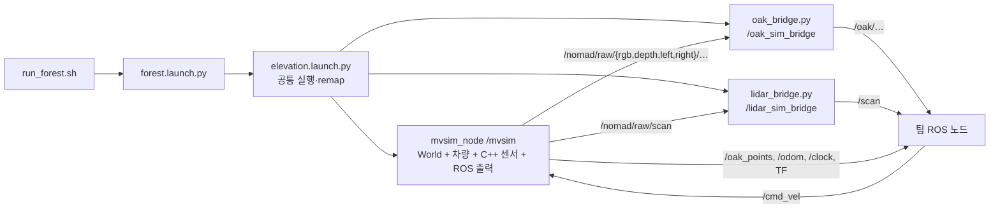
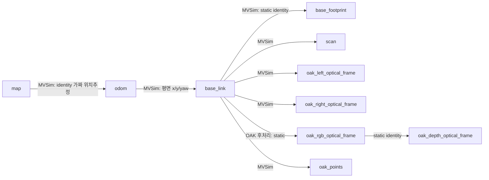

# NOMAD ROS 2 워크스페이스: 팀원 AI 작업 지침

이 문서는 **이 저장소의 현재 구현**을 설명한다. 팀원 AI는 설치 요청에는 `README.md`의 절차를 따르고, 코드 작업에는 아래의 패키지 경계·토픽·좌표계·수정 위치를 기준으로 삼는다. 예전 대화나 다른 컴퓨터의 절대 경로보다 현재 체크아웃의 소스가 우선이다. 인터페이스를 바꾼다면 관련 문서도 갱신한다.

## 1. 범위와 기본 원칙

- 대상 환경: Ubuntu 24.04, ROS 2 Jazzy, MVSim 1.4.0. 현재 실행에는 Gazebo·Isaac Sim이 필요하지 않다. 최종 Isaac Sim 통합은 별도 단계다.
- 저장소 전체가 `colcon` 워크스페이스다. 기본 위치는 `~/nomad_ws`이며 `src/mvsim`과 `src/nomad_sim`을 함께 빌드한다. MVSim을 다시 복제하거나 패치를 재적용하지 않는다.
- `mvsim`은 엔진·ROS 노드, `nomad_sim`은 NOMAD 월드·센서 설정·후처리 노드다. 의존 방향은 `nomad_sim → mvsim`이다.
- 기존 `~/nomad_ws`나 팀원의 다른 파일은 임의로 덮어쓰지 않는다. `build/`, `install/`, `log/`는 각 컴퓨터에서 생성하며 Git으로 배포하지 않는다.
- **설치만 요청받았을 때**: `README.md`에 따라 의존성을 설치하고 `./.nomad/build.sh`로 빌드한 뒤 `./run_forest.sh`를 실행한다. 단위 테스트, 전체 토픽 검사, 성능 측정, 맵 재생성, 무관한 환경 감사는 추가하지 않는다. 실패하면 그 단계에 필요한 부분만 해결한다.
- **기능 개발을 요청받았을 때**: 변경 범위에 맞는 최소 빌드·검증을 수행한다. 요청과 무관한 전체 테스트나 맵 재생성을 습관적으로 추가하지 않는다. 현재 실행 중인 시뮬레이터 종료·상태 초기화가 필요하다면 먼저 확인한다.

## 2. 소스 지도

| 위치 | 역할 / 수정하는 경우 |
|---|---|
| [`README.md`](README.md) | 사람이 따라 하는 설치·실행 안내 |
| [`run_forest.sh`](run_forest.sh) | 최상위의 평소 실행 진입점. 환경을 읽고 실행 로그 디렉터리를 만든 뒤 forest launch 실행 |
| [`.nomad/env.sh`](.nomad/env.sh) | ROS Jazzy/로컬 overlay, 기본 `ROS_DOMAIN_ID=42`, `LOCALHOST` discovery |
| [`.nomad/build.sh`](.nomad/build.sh) | `colcon build --base-paths src --symlink-install --packages-up-to nomad_sim` |
| [`src/mvsim/`](src/mvsim/) | vendored MVSim 엔진·`mvsim_node`·Box2D. 수정 시 해당 디렉터리의 [`agents.md`](src/mvsim/agents.md)도 읽는다 |
| [`src/nomad_sim/launch/`](src/nomad_sim/launch/) | 프로세스 구성, 설정 로딩, 토픽 remap |
| [`src/nomad_sim/config/sensors.yaml`](src/nomad_sim/config/sensors.yaml) | OAK-D Lite FF·YDLIDAR G2 **임시 근사값** |
| [`src/nomad_sim/sensors/`](src/nomad_sim/sensors/) | 차량에 포함할 MVSim 센서 XML |
| [`src/nomad_sim/worlds/forest.world.xml`](src/nomad_sim/worlds/forest.world.xml) | 실행하는 월드 XML. 생성된 배치와 차량·센서 include |
| [`src/nomad_sim/assets/`](src/nomad_sim/assets/) | 높이맵·지면 텍스처·모델·하늘 텍스처 |
| [`src/nomad_sim/scripts/generate_forest_map.py`](src/nomad_sim/scripts/generate_forest_map.py), [`forest_models.py`](src/nomad_sim/scripts/forest_models.py) | 맵을 **의도적으로 재생성할 때만** 사용하는 제작 코드 |
| [`src/nomad_sim/scripts/oak_bridge.py`](src/nomad_sim/scripts/oak_bridge.py), [`lidar_bridge.py`](src/nomad_sim/scripts/lidar_bridge.py) | 이미 ROS 메시지인 센서 출력을 팀 인터페이스로 보정 |
| [`src/nomad_sim/CMakeLists.txt`](src/nomad_sim/CMakeLists.txt), [`package.xml`](src/nomad_sim/package.xml) | 새 파일 설치 규칙·ROS 의존성 |

`elevation.launch.py`는 이름과 달리 forest에서도 쓰는 **공통 센서 launch**다. `elevation.world.xml`은 별도 예제이며 `run_forest.sh`의 기본 월드는 `forest.world.xml`이다.

## 3. 실행과 데이터 흐름



`mvsim_node`는 자체 프로세스 안에 MVSim `World`를 소유한다. 엔진의 센서 관측을 **같은 프로세스의 ROS 어댑터**가 표준 메시지로 바꾼다. 따라서 두 `bridge.py`는 Gazebo 통신을 ROS로 변환하는 외부 브리지가 아니라 **ROS → ROS 후처리 노드**다. `mrpt-ros2bridge`는 변환 라이브러리이지 별도 프로세스가 아니다. MVSim의 ZMQ 포트 `23700`도 현재 센서 ROS 데이터의 주 경로가 아니며 중복 실행 점검에 사용된다.

```
config/sensors.yaml
  → launch/elevation.launch.py가 NOMAD_* 환경변수 계산
  → worlds/forest.world.xml이 차량 r1과 센서 XML include
  → MVSim이 $env{} 값을 읽고 SensorBase factory로 객체 생성
  → 엔진 관측 콜백 → mvsim_node ROS publisher → 필요 시 NOMAD 후처리
```

`sensors.yaml`에 키를 추가하는 것만으로 센서가 생기지 않는다. launch의 환경변수 전달과 차량 XML의 include도 필요하다. 현재 차량 `r1`에는 RGBD `oak` 1개, 좌/우 카메라 2개, 2D LiDAR `scan` 1개, 총 **4개 센서 객체**가 붙는다. 센서마다 별도 ROS 노드를 실행하지 않는다. XML의 `class`는 엔진 구현, `name`은 기본 토픽/frame, `pose_3d`는 장착 자세, `sensor_period`는 **시뮬레이션 시간 기준** 주기다. XML 위치는 m, 각도는 deg다.

## 4. 팀 코드가 사용할 ROS 인터페이스

`/nomad/raw/*`는 중간 인터페이스이므로 새 인지·계획 노드는 보통 **최종 토픽**을 구독한다. timestamp는 시뮬레이션 시간이다.

| raw 입력 / 발행 경로 | 팀에 노출되는 토픽 | 메시지·데이터 | frame |
|---|---|---|---|
| `/nomad/raw/rgb/image_raw` → OAK 후처리 | `/oak/rgb/image_raw` | `sensor_msgs/msg/Image`, 현재 `bgr8`, 640×480, 목표 30 Hz | `oak_rgb_optical_frame` |
| `/nomad/raw/depth/image_raw` → OAK 후처리 | `/oak/depth/image_raw` | `Image`, `16UC1`, 픽셀값 **mm**; 0은 유효하지 않은 깊이 | `oak_depth_optical_frame` |
| `/nomad/raw/left/image_raw` → OAK 후처리 | `/oak/left/image_rect` | `Image`, `mono8`, 640×480, 목표 30 Hz | `oak_left_optical_frame` |
| `/nomad/raw/right/image_raw` → OAK 후처리 | `/oak/right/image_rect` | `Image`, `mono8`, 640×480, 목표 30 Hz | `oak_right_optical_frame` |
| `/nomad/raw/scan` → LiDAR 후처리 | `/scan` | `sensor_msgs/msg/LaserScan`, 360°, 500 rays, 목표 10 Hz, 0.12–12 m | `scan` |
| MVSim 직접 발행 | `/oak_points` | `sensor_msgs/msg/PointCloud2`, 색상 없는 XYZ, 단위 m | `oak_points` |

각 영상에는 같은 경로의 `camera_info`가 있다. 최종 이름은 `/oak/rgb/camera_info`, `/oak/depth/camera_info`, `/oak/left/camera_info`, `/oak/right/camera_info`다. 대응 raw 이름은 `/nomad/raw/{rgb,depth,left,right}/camera_info`다. OAK 후처리는 RGB/depth 픽셀값을 유지하며 frame과 CameraInfo를 맞추고, 좌/우 컬러 렌더 출력을 `mono8`로 만든다. 현재 좌우 baseline은 **0.075 m**이며 우측 CameraInfo의 투영 행렬에 `Tx=-fx×baseline`이 들어간다.

깊이는 좌우 영상의 스테레오 매칭 결과가 아니다. 중앙 가상 depth camera가 장면 geometry를 직접 렌더한다. `/oak_points`는 RGBD 센서가 MVSim에서 직접 발행하는 점군으로 OAK 후처리를 지나지 않는다. `publish_ros_colored_pointcloud=false`는 **색상만 제외**하며 점군 전체를 끄지 않는다. 점군 frame의 축과 optical frame의 축도 다르다.

LiDAR의 `raytrace_3d=true`는 **3D LiDAR가 아닌 단일 2D 스캔 평면이 3D 지형과 교차한다**는 뜻이다. 차체가 기울면 측정 평면도 기울지만, 실제 회전형 G2의 점별 시간차는 재현하지 않는다. `LaserScan.ranges`는 m, 각도는 rad다. 후처리는 너무 가까운 값 `-inf`, 최대거리 이상/무응답 `+inf`, 비정상 값 `NaN`으로 표현하고 `scan_time=0.1s`, `time_increment=0`으로 둔다. 브리지는 새 센서 샘플을 생성하지 않는다.

| 그 밖의 인터페이스 | 소유자 / 의미 |
|---|---|
| `/cmd_vel` · `geometry_msgs/msg/Twist` | `/mvsim` 직접 구독. 현재 `linear.x`, `linear.y`, `angular.z` 입력 |
| `/odom` · `nav_msgs/msg/Odometry` | MVSim의 **평면** odometry. 언덕의 6D 자세를 온전히 나타내지 않음 |
| `/base_pose_ground_truth` | 엔진의 실제 3D pose. 위치추정 알고리즘 출력이 아님 |
| `/clock` · `rosgraph_msgs/msg/Clock` | MVSim의 시뮬레이션 시간. 소비 노드는 `use_sim_time:=true`; 시계 발행자 MVSim 자체는 현재 false |
| `/tf`, `/tf_static` | 아래 TF 소유권 참고. URDF·`robot_state_publisher` 기반 관절 트리가 아님 |

raw 센서 publisher는 현재 `KeepLast(50)/RELIABLE/VOLATILE`, NOMAD 후처리 publisher/subscriber는 `KeepLast(5)/RELIABLE/VOLATILE`이다. 모두 무조건 `SensorDataQoS`/best-effort라고 가정하지 않는다. 통신이 안 되면 실제 QoS를 확인한다.

## 5. TF와 시간: 언덕에서는 특히 주의



이것은 주요 frame만 나타낸 부분 트리이며 원본 RGB/depth frame도 존재한다. LiDAR 후처리는 TF를 만들지 않는다. 차량 기준 축은 전방 +X·좌측 +Y·상방 +Z, 카메라 optical 축은 영상 오른쪽 +X·아래 +Y·전방 +Z다.

**핵심 불일치:** 엔진은 지형에 따른 z/pitch/roll로 카메라·LiDAR를 렌더하지만, `/odom`과 `odom → base_link`는 평면 x/y/yaw 기반이다. `base_link → base_footprint`도 정적 identity여서 실제 지면 투영이 아니다. VIO·3D SLAM·경사 추정에서 센서를 세계 좌표에 누적하기 전에 이 차이를 해결해야 한다. `map → odom`은 `do_fake_localization=true`의 identity이므로 실제 localization을 붙일 때 TF 발행자 중복을 정리한다.

`ROS_DOMAIN_ID=42`와 `ROS_AUTOMATIC_DISCOVERY_RANGE=LOCALHOST`가 기본값이다. 다른 PC의 노드는 기본 상태에서 발견되지 않는다. 팀 노드는 같은 ROS 환경과 `use_sim_time=true`를 맞춘다. ROS domain을 바꿔도 MVSim의 고정 ZMQ 포트 23700 충돌은 격리되지 않는다.

## 6. 맵·차량의 현재 상태와 미구현 기능

- 기본 월드는 약 **70 × 50 m**의 굽은 흙길, 첫 갈림길의 오르막·내리막, 돌로 막힌 경로, 목적지 근처의 막다른 평지 경로로 구성된다. 최대 높이는 2.4 m다. 경로 선택·막다른 길에서 복귀는 아직 알고리즘이 아니다.
- `height.png`는 지형 높이, `terrain_render.png`는 지면 시각 텍스처다. 길 색이 곧 traversability cost나 마찰계수는 아니다. 비도로가 전부 자동으로 통행 불가 처리되는 것도 아니다.
- 나무·풀·바위의 외형과 물리 충돌/지지면은 구분한다. 많은 장식 물체는 `intangible=true`이며 가까운 물체만 충돌체다. 장식 물체가 차량 지지면 높이를 올리지 않도록 MVSim의 `Block.cpp`에 로컬 수정이 있다. `intangible`이어도 카메라/3D raytrace LiDAR에서 보일 수 있다.
- 차량은 MVSim 예제 **Jackal 차동구동 + `twist_ideal`**이다. 외형·바운딩박스만 바꿔도 Ackermann 조향·휠 조인트·모터 토크·서스펜션이 생기는 것은 아니다.
- 자체 차량/URDF 및 실제 링크·조인트, 페이로드에 따른 토크 한계와 등판 실패, 서보 장착 2D LiDAR, IMU/VINS, traversability 평가, 자율 분기 선택·복귀는 **미구현**이다. 이미 있다고 전제하지 않는다.
- OAK-D Lite FF와 YDLIDAR G2 숫자는 장비 측정·보정값이 아닌 임시 목표값이다. `image_rect` 이름도 실제 OAK의 왜곡·노출·스테레오 SDK 동작까지 재현했다는 뜻은 아니다.

## 7. 요청별 수정 위치

| 작업 | 시작 파일 / 이어서 확인할 곳 |
|---|---|
| 월드 지형·갈림길·장애물 | [맵 생성기](src/nomad_sim/scripts/generate_forest_map.py), [모델 정의](src/nomad_sim/scripts/forest_models.py), [월드 XML](src/nomad_sim/worlds/forest.world.xml), `assets/forest/`. 요청 없이 재생성하지 않는다 |
| 기존 카메라·LiDAR 수치 | [센서 YAML](src/nomad_sim/config/sensors.yaml) → [공통 launch](src/nomad_sim/launch/elevation.launch.py) → [센서 XML](src/nomad_sim/sensors/) → 해당 후처리. 토픽·TF·단위 변화도 확인 |
| 지원되는 센서 추가 | 새 XML에 고유 `name`, `class`, `pose_3d`, `sensor_period` 지정 → 차량 XML의 `<vehicle>` 안에 include → 필요 시 YAML/launch/remap/후처리·패키지 설치 규칙 수정. factory는 `laser`, `rgbd_camera`, `camera`, `lidar3d`, `imu`, `gnss` 지원 |
| 새로운 센서 **종류/물리** | [`SensorBase` factory](src/mvsim/modules/simulator/src/Sensors/SensorBase.cpp), 센서 C++ 구현, [ROS 관측 변환](src/mvsim/mvsim_node_src/mvsim_node.cpp), 빌드 파일. TF나 외형 mesh만 붙여도 측정값은 생기지 않는다 |
| 팀 인지·계획·제어 | 보통 `src/` 아래 별도 ROS 패키지로 만들고 최종 토픽·TF·시간·`/cmd_vel` 경계로 연결한다. 팀 알고리즘을 MVSim 엔진에 넣지 않는다 |
| 실제 차량 모델/조향/토크 | 차량 동역학·구동 인터페이스 요구부터 정의한다. 외형 모델과 물리 모델 교체는 별개이며 `/cmd_vel` 의미도 달라질 수 있다 |

MVSim 소스를 고쳐야 한다면 먼저 [`src/mvsim/agents.md`](src/mvsim/agents.md)을 읽고 그 지시를 따른다. 현재 로컬 엔진 변경은 종료 스레드 경합 수정과 `intangible` 물체의 elevation 처리 수정이며 참고 패치가 [`src/nomad_sim/patches/`](src/nomad_sim/patches/)에 있다. 소스에는 이미 적용됐으므로 설치 시 재적용하지 않는다. 엔진 수정 시 영향과 패치를 문서화한다.

## 8. 빌드·실행과 작업 종료 기준

```bash
cd ~/nomad_ws
./.nomad/build.sh
./run_forest.sh
```

설치 절차는 `README.md`가 우선이다. `run_forest.sh`는 환경을 내부에서 읽으며 종료는 실행 터미널의 Ctrl+C다. 포트 23700이 사용 중이면 기존 MVSim을 사용자가 종료할지 확인한다. 스크립트가 기존 프로세스를 자동 종료하지 않는다. 생성 파일은 `build/`, `install/`, `log/`에 남고 Git에서 제외된다.

문서만 바꾼 작업에 시뮬레이터 전체 빌드·실행을 요구하지 않는다. 코드 작업의 검증은 변경 경계에 맞게 최소화한다. 예를 들어 브리지 로직이면 해당 단위 테스트, launch 구성이면 관련 빌드/시작 확인을 선택한다. 실제 하지 않은 테스트나 관측은 했다고 쓰지 않는다. 토픽·메시지·frame·단위·구현 상태를 바꾸면 이 문서와 필요 시 `README.md`도 갱신한다.
