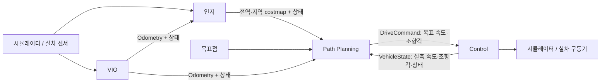

# NOMAD 모듈 통합·교체 가이드

> 2026-10-02 · 인지 / VIO / Path Planning / Control의 독립 교체 구조

## 모듈별 문서

| 담당 | 별도 문서 | 책임 |
|---|---|---|
| 인지 | [nomad_perception/README.md](../nomad_perception/README.md) | 센서 관측 → 전역/지역 costmap·상태 |
| VIO | [nomad_vio/README.md](../nomad_vio/README.md) | 센서/기본 시뮬레이터 → 차량 자세·속도·상태 |
| Path Planning | [nomad_path_planning/README.md](../nomad_path_planning/README.md) | GPP·LPP·후진 복구 → 목표 속도·조향각 |
| Control | [nomad_control/README.md](../nomad_control/README.md) | 목표 실행·만료 정지·실측 피드백 |
| 공통 | [nomad_interfaces/README.md](../nomad_interfaces/README.md) | 메시지 필드·단위·좌표·유효기간 |

각 담당자는 자신의 README에서 입력과 출력, 필수 QoS, 주기, 교체 절차를 확인할 수 있다. 이전 단일 planning 패키지의 센서 코드는 nomad_perception으로 이동했고, 기존 sim_controller_node의 계획 관련 판단은 Planning 최종 명령 선택기로 이동했다.



## 1. 한 파일로 토픽 이름 변경

[config/topics.yaml](config/topics.yaml)의 **값만 수정**한다. 예:

```yaml
# 기존 파일에서 아래 해당 키의 값만 변경한다.
perception:
  global_costmap: /team/perception/global_costmap
  local_costmap: /team/perception/local_costmap
  status: /team/perception/status
planning:
  drive_command: /team/planning/drive_command
control:
  vehicle_state: /team/control/vehicle_state
  status: /team/control/status
```

이 예시는 전체 파일이 아니다. 실제 파일의 `topics:` 아래에 있는 모든 키를 유지해야 한다. 누락·알 수 없는 키·잘못된 절대 토픽명·서로 다른 키의 같은 토픽 이름은 실행 전에 거부한다.

공통 launch가 각 노드의 publisher/subscriber에 같은 remapping을 적용한다. GPP의 costmap은 전역 주행 지도, LPP·복구·선택기의 costmap은 지역 주행 지도로 연결한다. `forest.launch.py`로 전체 시뮬레이터를 시작하면 Gazebo ROS bridge/센서 후처리/RViz에도 같은 센서 이름을 적용한다.

- symlink-install 빌드에서는 YAML 값 수정 후 **관련 노드를 재시작**하면 반영된다. 이미 실행 중인 노드는 자동 변경되지 않는다.
- 외부 노드는 이 파일을 자동으로 읽지 않는다. 팀 노드에서도 같은 이름을 설정하거나 remap해야 한다.
- 모든 모듈을 별도 launch할 때도 같은 `topics_file` 경로를 넘긴다.
- `/tf`, `/tf_static`, `/clock`, 원시 Gazebo 내부 bridge 토픽과 ROS 인프라 토픽은 이 모듈 설정 범위 밖이다.
- 타입은 공통 메시지로 고정한다. 다른 타입과 연결하려면 어댑터가 필요하다.
- 예전 `cmd_vel_topic:=...` 인자는 호환용으로 Control 구동 출력만 덮어쓴다. 새 작업은 topics_file을 우선한다.

## 2. 기본 구현 / 팀 구현 선택

[config/modules.yaml](config/modules.yaml):

```yaml
perception: builtin
vio: builtin
control: builtin
tf_owner: gazebo
```

외부 인지와 실차 Control을 연결하는 예:

```yaml
perception: external
vio: builtin
control: external
tf_owner: gazebo
```

`external`이면 해당 기본 노드를 시작하지 않는다. 외부 실행 파일을 추측해서 대신 실행하지 않으며, 각 팀이 자신의 모듈을 별도로 실행한다. Planning은 항상 이 프로젝트 구현을 사용한다. 인지/VIO가 유효 상태를 내고 Control 피드백이 준비될 때까지 Planning은 정지한다.

외부 VIO는 `vio: external`과 `tf_owner: vio`를 함께 사용한다. 전체 forest launch는 Gazebo의 odom→base_link TF bridge를 끄고 외부 VIO가 이를 소유하도록 한다. 센서 정적 TF는 유지한다. 잘못된 조합은 거부한다. 이미 실행 중인 Gazebo의 TF 발행자를 동적으로 바꾸지는 않는다.

## 3. 빌드와 실행

```bash
cd ~/nomad_ws
source .nomad/env.sh
colcon build --base-paths src --packages-up-to nomad_bringup nomad_gazebo --symlink-install
source install/local_setup.bash
```

전체 실행(기존 Gazebo가 실행 중이면 중복 시작하지 않는다):

```bash
./run_autonomy.sh
# 또는
ros2 launch nomad_bringup forest.launch.py
```

실행하면 기존 숲 실행과 같은 맵 번호 선택 메뉴가 나타난다. 특정 맵은
`NOMAD_MAP=08_vio_reverse_dead_end ./run_autonomy.sh`로 바로 선택한다.
`vegetation:=false`는 선택한 맵의 무식생 버전을 사용하고,
`world_file:=/path/to/world.sdf`를 지정하면 메뉴를 건너뛴다.
비대화형 실행의 기본 맵은 `02_fork2_gentle`이며 `--check`는 맵 선택 없이 환경만 확인한다.


Gazebo가 별도 실행 중이고 기본 토픽/TF 설정이 일치한다면 자율주행 모듈만 시작한다.

```bash
ros2 launch nomad_bringup autonomy.launch.py rviz:=true
```

각 모듈을 개별 터미널에서 실행할 수도 있다.

```bash
ros2 launch nomad_bringup perception.launch.py
ros2 launch nomad_bringup vio.launch.py
ros2 launch nomad_bringup planning.launch.py rviz:=true
ros2 launch nomad_bringup control.launch.py
```

전체와 단독 launch는 같은 domain의 모듈 잠금을 공유해 중복을 방지한다. 각 터미널은 동일 환경과 domain을 사용한다. 전체 모듈 실행이 기본값일 때 인지 1, VIO 1, Planning 5, Control 1의 총 8개 노드다. RViz와 Gazebo 지원 노드는 별도다.

별도 설정 파일은 모든 launch에서 지정할 수 있다.

```bash
ros2 launch nomad_bringup autonomy.launch.py \
  topics_file:=$HOME/nomad_ws/src/nomad_bringup/config/topics.yaml \
  modules_file:=$HOME/nomad_ws/src/nomad_bringup/config/modules.yaml \
  vehicle_file:=$HOME/nomad_ws/src/nomad_bringup/config/vehicle.yaml
```

`params_file:=/absolute/overrides.yaml`은 선택적인 ROS parameter 덮어쓰기다. 우선순위는 모듈 기본 설정 → vehicle_file → params_file이다. vehicle.yaml은 소프트웨어 값이며 Gazebo SDF 기하를 자동으로 바꾸지 않는다. 축거·좌표·조향 한계를 바꾸면 실제 차량 모델과도 맞아야 한다.

기존 `nomad_path_planning planning.launch.py`와 `forest_planning.launch.py`는 각각 전체 모듈/전체 숲 실행으로 넘기는 호환 진입점이다. 새 `nomad_bringup planning.launch.py`는 Planning만 시작한다.

## 4. 기본 주기·만료

| 항목 | 기본 설정 | 시간 기준 |
|---|---|---|
| 인지 지도 작업 / 상태 | 작업 시도 10Hz / 상태 10Hz | wall, 데이터 나이는 ROS |
| VIO 출력 | 유효 odom 수신마다; 기본 Gazebo 목표 50Hz | 센서/ROS |
| VIO 상태 / Planning 입력 검증 | 10Hz | wall |
| GPP 재시도 타이머 | 5Hz + 이벤트 기반 요청, 내부 제한 있음 | ROS |
| LPP / 최종 DriveCommand | 10Hz | wall |
| 복구 supervisor | 10Hz | ROS |
| Control 출력 / VehicleState | 20Hz | wall |
| DriveCommand 유효기간 | 0.3초 | 생성 ROS 시각부터 |
| Control 무수신 정지 | 0.35초 | wall |
| 모듈 상태 유효기간 | 0.6초 | ROS |

wall 주기와 시뮬레이션 센서 Hz는 서로 다르다. 실제 지도 처리량이나 실차 PWM 주기를 이 표의 타이머 숫자로 보장하는 것은 아니다.

## 5. 연결 점검

- costmap frame과 VIO header.frame_id, 목표 frame을 일치시킨다. quaternion 정규화와 단위를 확인한다.
- 전역/지역 costmap은 Transient Local로 발행한다. 지역 지도는 관측 만료를 반영한다.
- odom→base_link TF는 하나만 발행하고 관측 시각에 조회 가능해야 한다.
- Control 피드백은 실측값으로 발행한다. speed_valid/steering_valid/ready가 거짓이면 주행하지 않는다.
- 도착·경로 선택·후진 복구는 Planning 담당이다. 외부 Control에 이 로직을 복제하지 않는다.
- 노드 한 개가 종료되면 같은 launch 그룹의 나머지 노드도 종료한다. 별도로 실행한 외부 모듈은 소유자가 관리한다.

검증 방법과 실제 결과: [docs/VALIDATION.md](docs/VALIDATION.md).

## GPP / LPP 선택

전체 실행에 `gpp:=hybrid_astar lpp:=rpp`처럼 전달한다. 같은 인자는 `planning.launch.py`, `autonomy.launch.py`, `forest.launch.py`에도 적용된다. 생략하면 기존 YAML 설정(D* Lite + rollout)을 따른다. 기존 맵 선택과 함께 사용할 수 있다. 지원 목록·상위 5개 조합의 실행 예·Field D* 변형 및 참조 경로 어댑터의 범위는 [Planning 알고리즘 선택 문서](../nomad_path_planning/README.md#알고리즘-선택-실행-2026-10-06)를 참조한다.
