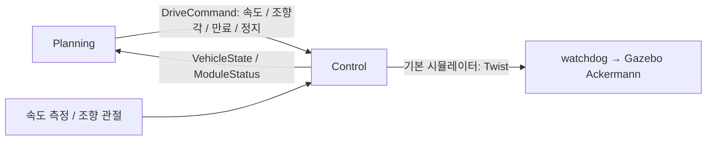

# Control 모듈 — nomad_control

> 인터페이스 버전 1 · 2026-10-02 · ROS 2 Jazzy

Control 담당자는 Planning이 선택한 **목표 속도·목표 조향각**을 구동기로 전달하고, 실제 차량 속도·조향각과 상태를 되돌려 준다. 경로 선택·충돌 검사·목표 도착 판단·후진 경로 선택은 Planning이 담당한다.

## 1. 경계와 기본 구현



실행 파일 `controller`, 노드 `nomad_control`. 경로·costmap·목표 토픽을 구독하지 않는다. 기본 구현은 Gazebo 속도 인터페이스에 맞추는 어댑터이며 실차 PWM 제어기나 새로운 PID 제어기를 구현한 것은 아니다. 실차 팀은 이 모듈만 교체해 PID/모터/서보 제어를 구현할 수 있다.

## 2. 입력

| 설정 키 | 기본 토픽 | 타입 | 의미 / QoS |
|---|---|---|---|
| `planning.drive_command` | `/nomad/planning/drive_command` | `nomad_interfaces/msg/DriveCommand` | 목표 속도·조향각; Reliable/Volatile/depth 1 |
| `sensors.odometry` | `/odom` | `nav_msgs/msg/Odometry` | 기본 시뮬레이터의 실제 속도 대체 측정; Best Effort/Volatile/depth 1 |
| `sensors.joint_states` | `/joint_states` | `sensor_msgs/msg/JointState` | 실제 좌·우 앞바퀴 조향 관절각; Best Effort/Volatile/depth 1 |
| 인프라 | `/clock` | `rosgraph_msgs/msg/Clock` | 명령 stamp/lease와 측정 시각 판단 |

외부 Control은 Gazebo odom/joint_states 대신 자체 엔코더·조향 센서를 사용해도 된다. Planning과 공유하는 경계는 DriveCommand와 VehicleState다.

## 3. DriveCommand 필드와 수신 규칙

| 필드 | 단위 / 정의 |
|---|---|
| `header.stamp` | 생성 시각 ROS time |
| `header.frame_id` | `base_link` |
| `target_speed` | 뒷축 중심 종방향 m/s. 양수 전진, 음수 후진 |
| `target_steering_angle` | 가상 전륜 중심 조향각 rad. 양수 왼쪽, 음수 오른쪽. 후진해도 부호 정의 유지 |
| `valid_for` | 생성 시각부터 명령이 유효한 ROS 기간; Planning 기본 0.3초 |
| `stop_requested` | true면 수치 목표보다 우선하여 정지. 이전 명령 자동 재개 금지 |

1. frame·유한값·stamp·기간·차량 한계를 검사한다. 기본 한계 ±0.4m/s, ±0.4rad이며 범위 밖 명령은 거부하고 정지한다. 최대 허용 lease는 0.5초다.
2. 유효한 새 명령만 저장한다. 이전 timestamp 메시지나 같은 timestamp의 이동 명령으로 유효기간을 연장하지 않는다. 같은 timestamp의 정지 요청은 이동을 덮어쓴다.
3. ROS lease가 끝나거나 새 명령이 wall time **0.35초** 동안 없으면 정지한다.
4. 측정 속도/조향각이 유효하지 않거나 시계가 멈추거나 fault면 정지한다.
5. 전진↔후진 전환 시 측정 속도가 0.03m/s보다 크면 먼저 정지 명령을 출력한다.

정지 요청은 `stop_requested=true`를 사용한다. 목표 속도 0만 주는 것보다 의미가 명확하다. 정지 후 재출발하려면 새 timestamp의 유효한 이동 명령이 필요하다.

## 4. 출력 및 실측 피드백

| 설정 키 | 기본 토픽 | 타입 | 의미 / 주기 |
|---|---|---|---|
| `control.vehicle_state` | `/nomad/control/vehicle_state` | `nomad_interfaces/msg/VehicleState` | 실제 속도/조향·ready/fault; 기본 wall 20Hz |
| `control.status` | `/nomad/control/status` | `nomad_interfaces/msg/ModuleStatus` | 상태 설명; 기본 wall 20Hz, lease 0.6초 |
| `control.simulator_command` | `/cmd_vel` | `geometry_msgs/msg/Twist` | 기본 Gazebo용 구동 명령; wall 20Hz |

피드백/상태/구동 출력은 Reliable/Volatile/depth 10이다.

`VehicleState`의 `header.stamp`는 상태를 조립한 시각, frame은 base_link다. `speed`, `steering_angle`은 실측값이며 **목표값을 복사하여 실측인 것처럼 발행하지 않는다.** 각각 m/s와 rad, 부호는 DriveCommand와 같다. `speed_valid`, `steering_valid`는 각 측정의 신선성과 수치 유효성을 뜻한다. `ready`는 명령을 실행할 수 있는 준비 상태, `fault`는 고장/복구 필요 상태, `detail`은 진단 문자열이다.

기본 속도는 Gazebo odometry의 body longitudinal speed를 사용한다. 두 앞바퀴 측정각은 Ackermann 기하로 전륜 중심 조향각으로 환산한다. 측정 나이는 최대 0.6 ROS초 / 3 wall초다. 실제 센서가 없으면 valid=false로 보고하고 ready=false를 유지한다. 시계가 뒤로 가면 fault가 유지되어 노드 재시작이 필요하다.

## 5. Gazebo 변환과 실차 차이

```text
Twist.linear.x  = target_speed
Twist.angular.z = target_speed / wheelbase * tan(target_steering_angle)
```

예: v=-0.2m/s, δ=+0.2rad, L=0.72m이면 yaw rate는 약 -0.0563rad/s다. 후진하면서 앞바퀴를 왼쪽으로 꺾으면 차체 yaw 변화가 음수가 되는 것이 정상이다. 음수 속도 자체가 후진 정보이므로 별도 기어 필드는 현재 인터페이스에 없다. 실차에서 기어 전환이 필요하면 Control이 처리한다.

기본 wheelbase=0.72m, track=0.60m다. Gazebo는 속도 명령형 Ackermann 플러그인을 사용하며 그 앞에 기존 0.35초 watchdog이 있다. Twist 방식은 속도 0일 때 조향각만 따로 전달하지 못하므로 **정지 상태 선조향을 보장하지 않는다.** 실차 Control은 속도와 조향각을 독립적으로 받아 구동기 특성에 맞게 실행할 수 있다.

Control 기본 주기는 wall 20Hz(50ms), Planning 명령은 wall 10Hz(100ms)다. 각 제어 tick에서 최신 유효한 목표를 사용한다. 이것은 PWM 주파수 규정이 아니다. 실차의 속도/조향 내부 제어주기와 PWM 캐리어 주파수는 Control 팀이 구동기에 맞게 결정해야 한다.

## 6. 실행·외부 구현으로 교체

```bash
cd ~/nomad_ws
source .nomad/env.sh
ros2 launch nomad_bringup control.launch.py
```

1. `modules.yaml`의 `control: external`로 기본 Control 실행을 끈다.
2. [topics.yaml](../nomad_bringup/config/topics.yaml)의 `planning.drive_command`, `control.vehicle_state`, `control.status`를 팀 모듈과 맞춘다.
3. 외부 Control이 공통 메시지를 구독/발행하고 위 만료·정지·측정 유효 규칙을 구현한다. 다른 타입을 이미 사용한다면 경계 어댑터를 둔다.
4. 실차 실행에서는 Gazebo용 `/cmd_vel` 출력이 필수는 아니다. 실제 모터/서보 출력 방식은 Control 내부다.
5. 차량 기하·한계·단위는 [vehicle.yaml](../nomad_bringup/config/vehicle.yaml)과 일치시킨다. 조향 서보 PWM을 `target_steering_angle`에 직접 넣지 않는다.

구현 설정: [config/parameters.yaml](config/parameters.yaml). 전체 메시지 예: [nomad_interfaces](../nomad_interfaces/README.md). 통합 절차: [nomad_bringup](../nomad_bringup/README.md).
