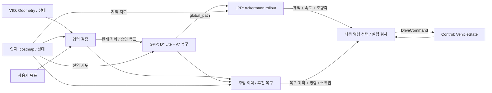

# Path Planning 모듈 — nomad_path_planning

> 인터페이스 버전 1 · 2026-10-02 · ROS 2 Jazzy

Planning은 인지 지도·VIO 자세·목표점·차량 피드백을 받아 **목표 속도와 목표 조향각**을 Control에 전달한다. GPP, LPP, 경로 충돌 검사, 목표 도착 판단, 후진 경로 선택과 최종 명령 선택은 모두 Planning에 속한다.

## 알고리즘 선택 실행 (2026-10-06)

기본 실행은 기존 **D* Lite + Ackermann rollout**이며, 기본 조합의 A* 복구와 후진 복구·최종 명령 검사를 유지한다. 아래 명령은 `/home/user/nomad_ws`에서 실행한다. 기존 실행을 종료한 뒤 한 조합씩 실행하며, 기존 맵 선택 메뉴도 그대로 사용할 수 있다.

`./run_autonomy.sh`를 터미널에서 실행하면 **맵 번호 → 알고리즘 조합 번호** 순서로 선택한다. 조합 번호는 아래 표 순서대로 1~6이며, Enter는 3번(D* Lite + rollout)이다. 잘못된 번호는 다시 입력받는다.

번호를 미리 지정하려면 `NOMAD_PLANNER_PAIR=1 ./run_autonomy.sh`처럼 실행한다. `NOMAD_MAP`과 함께 사용할 수 있다. 명시적인 `gpp:=`, `lpp:=`, `params_file:=` 인자가 있으면 조합 메뉴와 `NOMAD_PLANNER_PAIR`를 건너뛰고 해당 설정을 사용한다. 비대화형 실행에서 번호를 지정하지 않으면 기존 YAML 설정을 유지한다. `--check`는 메뉴 없이 기존 준비 상태 검사만 수행한다.

| 비교표 조합 | 실행 명령 |
|---|---|
| Hybrid A* → RPP | `./run_autonomy.sh gpp:=hybrid_astar lpp:=rpp` |
| State Lattice(A*) → RPP | `./run_autonomy.sh gpp:=state_lattice lpp:=rpp` |
| D* Lite → Ackermann rollout | `./run_autonomy.sh gpp:=dstar_lite lpp:=rollout` |
| A* → Ackermann rollout | `./run_autonomy.sh gpp:=astar lpp:=rollout` |
| Weighted A* → Ackermann rollout | `./run_autonomy.sh gpp:=weighted_astar lpp:=rollout` |
| Field D* 변형 → RPP | `./run_autonomy.sh gpp:=field_dstar lpp:=rpp` |

비교표 4번의 A*/Weighted A*를 분리했으므로 실제 선택 예시는 6개다. 맵 고정은 기존처럼 명령 앞에 `NOMAD_MAP=04_vio_flat_loop`를 붙인다. `headless:=true rviz:=false`도 함께 전달할 수 있다. 선택은 시작 시 적용하며 실행 중 변경하려면 다시 시작한다.

### 구조와 확장

```text
nomad_path_planning/
  gpp/
    base.py             # Request / Result / GlobalPlanner 계약, 지도·예산 검사
    registry.py         # 이름 → 전략 객체 생성 (Factory)
    dstar_lite.py        # 기존 D* Lite 구현
    astar.py            # A* / Weighted A*
    hybrid_astar.py      # SE(2), 차량 곡선 전개 탐색
    state_lattice.py     # 정렬된 자세 격자·곡률 제한 primitive + A*
    field_dstar.py       # 보간 Bellman 갱신 + 증분 g/rhs 탐색 변형
    reference.py         # 기하 경로 → Ackermann 참조 경로 Adapter
  lpp/
    registry.py         # LocalPlanner 계약 / Factory
    rollout.py          # 기존 Ackermann rollout 구현
    rpp.py              # 차량 기준 Regulated Pure Pursuit
```

ROS 노드는 입출력·복구를 담당하고 알고리즘 객체를 Strategy로 선택한다. 새 알고리즘은 공통 계약을 구현하고 해당 registry에 등록한다. 기존 루트의 `dstar_lite.py`, `rollout.py`는 이전 import를 유지하는 호환 진입점이다. 실행 파일·노드 이름도 호환성을 위해 유지하므로 `dstar_lite_gpp`라는 노드가 Hybrid A*를 실행할 수 있다. 시작 로그의 `Selected GPP=..., LPP=...`로 실제 선택을 확인한다.

GPP 출력은 odom 좌표계의 base_link 경로 `nav_msgs/Path`다. LPP는 이 경로·현재 자세·지역 지도를 받아 예측 궤적과 그 궤적의 속도·조향각을 `PlannedMotion`으로 함께 발행한다. Control과 연결되는 기존 계약은 바뀌지 않는다.

### 구현 범위와 설정

- Hybrid A*는 전진 bicycle 곡선과 이산 자세 키를 사용한다. State Lattice는 격자 끝점·방향에 정렬된 곡률 제한 곡선 primitive를 사용한다. 두 구현은 목표 위치를 사용하며 목표 yaw 정렬과 전역 후진 탐색은 지원하지 않는다. 후진은 기존 복구 모듈이 담당한다.
- RPP는 추종 곡률을 계산하고 곡률·지형 비용·목표 거리로 속도를 조절하는 자체 구현이다. Nav2 RPP 패키지를 호출하는 구현은 아니다. 조향 한계를 초과하거나 예측 궤적이 장애물/미관측 구간을 통과하면 실패를 반환한다. 별도의 지역 우회 경로를 탐색하지 않는다.
- **Field D*는 원 논문의 해석적 두 셀 보간식을 그대로 재현한 표준 구현이 아니다.** 인접 삼각형의 보수적 비용과 선형 보간 최소화를 사용하는 증분 변형이다. 실제 보간된 rhs 갱신을 수행하고 추출 경로에는 충돌 검사와 비용 비증가 조건의 단축을 적용한다. 논문 알고리즘의 성능·최적성 보장을 이 구현의 보장으로 간주하지 않는다.
- Field D* 등 기하 경로를 RPP와 조합하면 경로 주변 1.2m corridor 안에서 Hybrid A* 어댑터를 추가 실행한다. 조향 가능한 참조 경로를 만드는 단계이며 상태 메시지에 함께 표시된다. 따라서 이 조합의 계산 시간에는 어댑터 비용도 포함해야 한다. 적합한 참조 경로가 없으면 정지·재시도한다.
- 신규 전략의 탐색 예산은 기본 단계당 `gpp.time_budget: 1.0`초, `gpp.max_expansions: 50000`이다. 참조 어댑터는 별도 탐색 예산을 사용하고 지도 준비·경로 검사는 이 제한 밖이므로 전체 콜백의 엄격한 시간 제한은 아니다. 기본 레거시 조합의 탐색 동작은 유지한다.
- Weighted A* 기본 가중치는 `gpp.weighted_astar_weight: 1.5`, RPP 기본 설정은 `rpp.lookahead: 0.8`m, `rpp.lateral_accel: 0.35`m/s²다. 차량 설정은 기존 `vehicle_file`을 공유한다.
- `config/planning.yaml` 또는 `params_file`로 기본값을 설정할 수 있다. GPP 노드에는 `gpp_algorithm`, `lpp_algorithm`을, LPP 노드에는 `lpp_algorithm`을 설정한다. `gpp:=...`, `lpp:=...` 인자는 관련 노드의 YAML 설정보다 우선한다. 인자를 생략하면 YAML 값이 적용된다.
- 이름 오타는 launch에서 거부한다. 신규 전략이 실패해도 다른 GPP로 몰래 변경하지 않는다. 모든 조합이 모든 지형에서 성공하거나 비교표의 이론적 순위를 재현한다는 뜻은 아니다.

검증은 알고리즘 경로·곡률·장애물·지도 갱신·진입 금지 gate 검사와, 격리된 ROS 도메인에서 6개 조합의 경로/주행 메시지·잘못된 지도 정지·입력 복구를 포함한다. Gazebo 실제 지형에서의 완주 성능은 별도로 평가해야 한다.

## 1. 내부 구조 (기본 조합)



| 노드 | 역할 |
|---|---|
| `nomad_planning_inputs` | VIO·인지 상태·시간 검증, 내부 pose/health 발행, 목표 승인 |
| `dstar_lite_gpp` | D* Lite 전역 탐색, 지도 변경 갱신, A* fallback와 재시도 |
| `ackermann_rollout_lpp` | 차량 축거/조향 한계로 후보 궤적 생성, 충돌 검사·점수화·선택 |
| `nomad_recovery_supervisor` | 주행 이력 저장, 후진 및 탈출 기동, 재진입 금지 방향 gate |
| `nomad_planning_command` | 일반/복구 명령 우선순위, 최신 지도·피드백·도착 검사, DriveCommand 단일 발행 |

이전 `sim_controller_node` 안에 있던 경로 선택·실행 검사 코드는 최종 명령 선택 노드로 이동했다. 명칭상 제어기였던 코드의 역할을 Planning으로 분명히 한 것이다. 새 Control은 경로·지도·목표점을 구독하지 않는다.

## 2. 모듈 외부 입력

| 설정 키 | 기본 토픽 | 타입 | 공급자 / 내용 |
|---|---|---|---|
| `perception.global_costmap` | `/nomad/navigation_costmap` | `nav_msgs/msg/OccupancyGrid` | 인지; 누적 통행 비용 |
| `perception.local_costmap` | `/nomad/navigation_local_costmap` | `nav_msgs/msg/OccupancyGrid` | 인지; 최근 관측·충돌 검사 |
| `perception.status` | `/nomad/perception/status` | `nomad_interfaces/msg/ModuleStatus` | 인지 데이터 유효 상태 |
| `localization.odometry` | `/nomad/localization/odometry` | `nav_msgs/msg/Odometry` | VIO; odom 기준 base_link 3D pose/twist |
| `localization.status` | `/nomad/localization/status` | `nomad_interfaces/msg/ModuleStatus` | VIO 초기화·추적 상태 |
| `planning.goal_request` | `/goal_pose` | `geometry_msgs/msg/PoseStamped` | RViz/상위 작업; odom x,y 목표 |
| `control.vehicle_state` | `/nomad/control/vehicle_state` | `nomad_interfaces/msg/VehicleState` | Control; 실측 속도·조향각, 유효/준비/fault |
| 인프라 | `/clock` | `rosgraph_msgs/msg/Clock` | use_sim_time=true일 때 기준 시계 |

목표의 yaw는 현재 도착 조건으로 사용하지 않는다. 입력 목표의 frame은 planning_frame과 같아야 한다. 지도 회전 원점은 지원하지 않는다. 지도 데이터·frame·timestamp 계약은 [인지 문서](../nomad_perception/README.md)를 따른다.

지도는 Reliable/Transient Local/depth 1, 외부 odom·상태·피드백은 Reliable/Volatile/depth 10이다. 목표 요청은 Reliable/Volatile이며 내부 승인 목표는 Transient Local로 보존한다.

## 3. 모듈 외부 출력

| 설정 키 | 기본 토픽 | 타입 | 의미 / 수신자 |
|---|---|---|---|
| `planning.drive_command` | `/nomad/planning/drive_command` | `nomad_interfaces/msg/DriveCommand` | Control에 목표 속도·조향각·유효기간·정지 요청 |
| `planning.status` | `/nomad/planning/status` | `nomad_interfaces/msg/ModuleStatus` | 상위 모니터링용 상태 |
| `planning.goal` | `/nomad/goal` | `geometry_msgs/msg/PoseStamped` | 내부 승인 목표; 인지는 지도 범위 확장에도 사용 |

DriveCommand는 wall-clock **10Hz**, Reliable/Volatile/depth 1, 기본 유효기간 **0.3 ROS초**다. header는 ROS time/base_link다. `target_speed` 단위 m/s, 음수는 후진. `target_steering_angle` 단위 rad, 양수는 차량 기준 왼쪽이며 후진에서도 이 정의는 바뀌지 않는다. 정지 시 0/0과 `stop_requested=true`를 발행한다.

후진 예:

```yaml
header:
  stamp: {sec: 125, nanosec: 200000000}
  frame_id: base_link
target_speed: -0.2
target_steering_angle: 0.15
valid_for: {sec: 0, nanosec: 300000000}
stop_requested: false
```

속도는 뒷축 중심의 종방향 속도, 조향각은 가상의 전륜 중심 조향각이다. 경로점은 base_link 위치를 나타내므로 `reference_offset=0.36m`로 축 기준 차이를 반영한다. 메시지 필드·수신 규칙은 [공통 명세](../nomad_interfaces/README.md)에 정의한다.

## 4. GPP → LPP 데이터와 탐색 과정 (기본 조합)

1. VIO 현재 위치와 목표를 costmap 셀로 변환한다.
2. D* Lite가 목표에서 시작해 목표까지의 비용을 계산한다. `g`는 현재 저장된 비용 추정, `rhs`는 인접 셀 비용으로 계산한 한 단계 갱신값이다. 불일치 셀을 큐에서 처리해 일관성을 회복한다.
3. 지도 비용이나 차량 위치가 변하면 이전 g/rhs를 재사용해 필요한 부분을 갱신한다. 현재 차량 위치에서 목표까지 셀 경로를 추출한다.
4. D* Lite가 경로를 얻지 못하면 **그 시점의 현재 차량 위치**에서 A*로 새 탐색을 시도한다. 최초 출발점으로 돌아가 탐색하는 것이 아니다. 통과 가능한 경로 자체가 없으면 A*도 실패한다.
5. 두 탐색이 실패하면 빈 전역 경로와 실패 상태를 발행하고 재시도한다. LPP 실패 피드백도 재계획에 사용한다.
6. 성공 경로를 `nav_msgs/msg/Path`, `/nomad/global_path`, `frame_id=odom`으로 LPP에 전달한다. 각 x,y는 odom의 절대 위치 [m]이며 현재 차량 기준 상대 좌표가 아니다.

전역 cost 0~79는 `1+4*value/79` 가중치, -1은 `unknown_penalty`(기본 4.5), 80 이상은 통과 불가다. 실제 간선 비용은 이 가중치와 인접/대각 이동 거리를 사용한다. GPP의 미관측 탐색 허용은 LPP의 미관측 주행 허용을 뜻하지 않는다.

전역 경로의 yaw는 경로 접선에서 만들어지는 참고 방향이다. 일반 LPP는 전역 x,y와 **현재 차량의 VIO yaw**로 후보를 생성한다. 반면 LPP·복구가 만든 지역 궤적의 yaw는 차량 자세 예측이며 실행 검사와 복구에서 사용된다.

## 5. LPP·후진·최종 선택

LPP는 Ackermann 모델로 조향 후보를 전개하고 지역 지도 충돌, 전역 경로 추종, 목표 방향 등을 평가해 후보를 선택한다. 기본 전진 0.4m/s, 조향 한계 ±0.4rad, 축거 0.72m. 일반 LPP 계산은 wall-clock 10Hz이며 최종 목표 부근에서는 후보 길이와 실행 속도를 줄인다.

선택한 궤적과 **그 궤적을 생성한 속도·조향각**을 `PlannedMotion` 하나에 묶는다. 경로점 두 개를 보고 속도/조향을 재추정하지 않으며 서로 다른 타이머의 경로와 명령이 섞이지 않도록 했다.

막다른길 복구는 기본적으로 **실제로 전진해 온 주행 이력을 역으로 따라가는 후보**를 사용한다. 뒤쪽을 향한 GPP 전역 경로를 그대로 후진 추종하는 방식은 아니다. 복구 중에도 새 지역 지도에서 뒤쪽 충돌·미관측을 검사한다. 돌아 나갈 수 있는 전진 탈출 후보를 확인하면 SWITCH→EXIT를 거쳐 일반 주행으로 복귀한다. 필요 시 짧은 전후진 각도 조정이 개입하며 시간·거리·횟수 한계 또는 이력 부족/장애물로 복구가 보류될 수 있다. Frontier 탐색은 사용하지 않는다.

복구가 active이면 빈/한 점 궤적도 **복구 대기**를 뜻한다. 그때 일반 LPP 명령으로 넘어가면 안 된다. `active=false`를 받을 때만 일반 주행으로 소유권을 돌리고 과거 지역 경로는 폐기한다.

최종 선택기는 지도·경로 최신성, 목표 일치, 전역 경로가 뒤를 향하는지, 실제 차량 준비 상태, 도착 반경 0.35m 등을 검사한다. 방향을 전환할 때는 측정 속도가 0.03m/s 이하로 줄어든 뒤 반대 방향 명령을 내보낸다. 경로 점검과 도착 판단의 담당은 Planning이다.

## 6. 내부/진단 토픽

| 기본 토픽 | 타입 | 소비 / 용도 |
|---|---|---|
| `/nomad/current_pose` | PoseStamped | Planning 내부 VIO 어댑터 출력 |
| `/nomad/sensors_ready` | Bool | 인지+VIO 유효성 집계 |
| `/nomad/global_path` | Path | GPP→LPP·복구·선택기, RViz; Reliable/Transient Local/1 |
| `/nomad/local_path`, `/nomad/recovery_path` | Path | RViz/진단용 궤적 |
| `/nomad/planning/local_motion`, `/nomad/planning/recovery_motion` | PlannedMotion | LPP/복구→최종 선택기; Reliable/Volatile/10 |
| `/nomad/lpp_failed` | Bool | LPP→GPP 재계획 피드백 |
| `/nomad/recovery_reference` | Path | 되짚을 주행 이력 시각화 |
| `/nomad/recovery_gates` | geometry_msgs/msg/PoseArray | 복구용 재진입 방향 gate 인코딩; 내부 계약 |
| `/nomad/{gpp,lpp,recovery,planning}_status` | String | 상세 진단 |

Path 계열은 nav_msgs/msg/Path, PoseStamped는 geometry_msgs/msg/PoseStamped, Bool/String은 std_msgs 타입이다. 내부 토픽도 topics.yaml에서 이름을 바꿀 수 있지만 외부 Control의 필수 입력은 DriveCommand뿐이다.

## 7. 시간·실패 조건

- 인지/VIO ModuleStatus가 유효한 READY이고 최신 자세가 있어야 실행한다.
- 선택기는 VehicleState 나이 0.6 ROS초 / 0.6 wall초, 경로 생성 시각 0.5 ROS초, 지역 지도 헤더 2 ROS초 이내를 요구한다. 지역 셀 자체의 만료는 인지가 별도로 처리한다.
- 시계가 wall 0.5초 동안 진행하지 않으면 정지한다. 입력 어댑터/Control은 시계 역행을 fault로 유지한다.
- GPP 경로가 없더라도 유효한 복구 기동은 실행할 수 있다. 일반 주행은 새 전역·지역 경로를 기다린다.
- Control이 준비되지 않았거나 명령이 누락되어도 오래된 주행을 계속하지 않는다. Control 자체에도 독립적인 명령 만료 정지가 있다.

## 8. 실행·설정·검증

```bash
cd ~/nomad_ws
source .nomad/env.sh
ros2 launch nomad_bringup planning.launch.py rviz:=true
```

이는 **Planning의 다섯 노드만** 시작한다. 인지·VIO·Control은 별도로 시작해야 한다. 과거 `ros2 launch nomad_path_planning planning.launch.py`는 호환 목적으로 전체 기본 모듈을 시작한다. 새 코드는 nomad_bringup 진입점을 사용한다.

[config/planning.yaml](config/planning.yaml)은 알고리즘 설정, [vehicle.yaml](../nomad_bringup/config/vehicle.yaml)은 공통 기하/한계, [topics.yaml](../nomad_bringup/config/topics.yaml)은 연결 이름이다. 외부 팀의 메시지 타입이 다르면 어댑터가 필요하다. 문자열 타입 변경만으로 자동 변환되지 않는다.

전체 빌드·팀 연결·현재 검증 결과는 [nomad_bringup](../nomad_bringup/README.md), [검증 기록](../nomad_bringup/docs/VALIDATION.md). 기존 구현 설명과 과거 검증은 [LEGACY_IMPLEMENTATION](docs/LEGACY_IMPLEMENTATION.md), [이전 VALIDATION](VALIDATION.md)에 보존한다.
