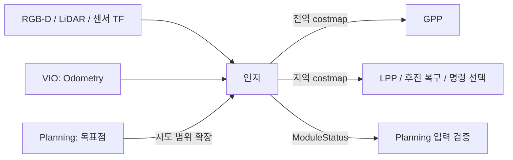

# 인지 모듈 — nomad_perception

> 인터페이스 버전 1 · 2026-10-02 · ROS 2 Jazzy

인지 담당자는 센서 관측과 VIO 위치를 같은 좌표계에 정합하고, Planning이 읽을 **전역·지역 통행 비용 지도와 인지 상태**를 제공한다. 목표 속도·조향각, 경로 선택, 막다른길 복구는 Planning의 책임이다.

## 1. 경계와 현재 구현



실행 노드 `nomad_perception`; 실행 파일 `perception`. 기존 센서·지면·식생·관측 지도 코드는 이 패키지로 이동했다. 지도 계산은 하나의 작업으로 처리하고, 센서 수신/상태 확인은 별도 callback group에서 처리한다.

현재 기본은 카메라 geometry 관측으로 장애물을 판정한다. `navigation.lidar_enabled: false`이므로 **주행 지도에서 LiDAR 장애물·팽창을 제외**한다. LiDAR 자유 ray는 차체 아래 등의 관측된 자유 공간에 사용한다. `/nomad/costmap`은 기존 융합 결과의 진단용 지도이며 실제 GPP 입력은 `/nomad/navigation_costmap`이다. 카메라 기반 지면 연결, 돌출 물체 판정, 풀 처리와 기존 안전 여유는 유지했다.

## 2. 입력

토픽명은 기본값이다. 실제 이름은 [공통 topics.yaml](../nomad_bringup/config/topics.yaml)을 따른다.

| 설정 키 | 기본 토픽 | 메시지 타입 | 공급자 / 의미 |
|---|---|---|---|
| `localization.odometry` | `/nomad/localization/odometry` | `nav_msgs/msg/Odometry` | VIO; `odom` 안의 `base_link` 3D 자세·속도 |
| `sensors.depth_image` | `/oak/depth/image_raw` | `sensor_msgs/msg/Image` | 깊이 영상; 기본 16UC1 mm, 구현은 32FC1 m도 지원 |
| `sensors.rgb_image` | `/oak/rgb/image_raw` | `sensor_msgs/msg/Image` | RGB-D 정렬 색상 영상, 기본 bgr8 |
| `sensors.depth_info`, `rgb_info` | `/oak/{depth,rgb}/camera_info` | `sensor_msgs/msg/CameraInfo` | 실제 영상에 맞는 내부 파라미터 |
| `sensors.scan` | `/scan` | `sensor_msgs/msg/LaserScan` | 2D LiDAR 거리 m·각도 rad; 자유 ray 및 선택적 장애물 융합 |
| `planning.goal` | `/nomad/goal` | `geometry_msgs/msg/PoseStamped` | Planning이 승인한 목표; 지도 범위 확장에만 사용 |
| 고정 인프라 | `/tf`, `/tf_static`, `/clock` | TF / Clock | 관측 시각의 센서→odom 변환, ROS 시간 |

센서 입력은 Best Effort, Volatile이며 최신 영상·scan·odom 위주(depth=1)로 처리한다. CameraInfo도 Best Effort/Volatile/depth 1로 수신한다. 외부 인지 구현은 자체 센서 파이프라인을 써도 되지만 아래 출력 계약은 지켜야 한다.

## 3. 출력

| 설정 키 | 기본 토픽 | 타입 | 수신자 / 의미 |
|---|---|---|---|
| `perception.global_costmap` | `/nomad/navigation_costmap` | `nav_msgs/msg/OccupancyGrid` | GPP; 누적 관측 기반 탐색 비용 지도 |
| `perception.local_costmap` | `/nomad/navigation_local_costmap` | `nav_msgs/msg/OccupancyGrid` | LPP·복구·최종 명령 선택; 최근 관측의 실행 가능 영역 |
| `perception.status` | `/nomad/perception/status` | `nomad_interfaces/msg/ModuleStatus` | Planning; READY/WAITING/FAULT와 만료 시간 |

지도 QoS는 **Reliable + Transient Local + Keep Last 1**이다. 늦게 시작한 Planning도 마지막 지도를 받되, 새 지도로 오인하지 않도록 원래 stamp를 보존해야 한다. 상태는 Reliable + Volatile + depth 10, 기본 wall-clock 10Hz, 유효기간 0.6초다.

진단 출력은 `debug.*`: `/nomad/observed_map`, `/nomad/costmap`, `/nomad/local_costmap`, `/nomad/terrain_costmap`(OccupancyGrid), `/nomad/mapping_status`, `/nomad/terrain_status`(String), `/nomad/perception_ready`(Bool). `/nomad/terrain_labels`(Image)는 colour 모드에서만 나온다. 팀 간 필수 계약은 위 세 출력이다.

## 4. Costmap 데이터 계약

- `header.frame_id = odom`(공통 `planning_frame`). VIO·목표·모든 경로와 일치해야 한다.
- `resolution`: m/cell, 기본 0.2m. `width`, `height`는 양수이며 데이터 길이는 width×height.
- 원점은 그리드 왼쪽 아래 셀의 모서리 위치다. 축에 정렬된 지도만 지원하며 `origin.orientation=(0,0,0,1)`을 사용한다. 회전된 grid는 Planning이 거부한다.
- `data[y*width+x]`에 셀 비용을 기록한다. 셀 중심은 `origin + ((x+0.5)*resolution, (y+0.5)*resolution)`.
- `-1`: 미관측/지역 관측 만료. `0`: 자유. `1~79`: 통과 가능하나 비싼 영역. `80~100`: 차단. 일반적인 장애물은 100.
- GPP는 미관측 셀을 높은 비용으로 탐색할 수 있다. **실제 LPP·후진 실행은 미관측을 통과하지 않는다.**
- 출력 주행 지도는 차량 충돌 여유를 이미 반영한다. 기본 인지 팽창 반경은 0.70m이며 격자 이산화 여유도 반영한다. 외부 인지가 이 역할을 맡는다. Planning에서 같은 팽창을 중복 적용하지 않는다.
- 전역 지도는 누적 관측을 활용한다. 지역 지도는 최근 관측을 요구하며 기본 `local_max_age=2.0`초가 지난 자유 영역을 미관측으로 되돌린다. 단순히 헤더만 갱신하여 오래된 자유 공간을 유효하게 만들면 안 된다.

예: resolution=0.2, width=4, height=2일 때 `data=[0,0,35,100, -1,0,79,100]`은 아래쪽 첫 행과 그 위 두 번째 행 순서다. 셀 비용은 지형/장애물 판단 결과이며 확률 보정 없이 확률로 해석하지 않는다.

## 5. 상태·주기·오류 처리

지도 작업은 wall-clock 10Hz 타이머로 시도한다. 계산 비용과 센서 수신에 따라 실제 발행률은 더 낮을 수 있으며 10Hz를 보장하지 않는다. 상태는 별도로 10Hz 확인한다. 시각·관측 만료 판단은 ROS 시간이며 정지된 시계에 대한 wall timeout도 적용한다.

현재 카메라 주행 모드에서는 최신 깊이 입력 0.6초, 처리 완료 지도 2초, 각각 wall time 3초 이내가 필요하다. TF 실패, 잘못된 자세, 관측 만료가 생기면 READY를 내리지 않아서는 안 된다. 외부 모듈도 데이터의 의미 있는 유효성을 확인한 뒤 READY를 발행해야 한다. 단순 노드 실행 여부가 READY의 기준은 아니다.

현재 `objects_only=true`, `slope_enabled=false`, `tilt_guard_enabled=false`다. 이는 기존 실험 설정이며 모든 야지 위험을 검증하는 인지는 아니다. 상세 원리·기존 실험 설명은 [분리 전 기록](../nomad_path_planning/docs/LEGACY_IMPLEMENTATION.md)에 보존했다.

## 6. 실행·교체

```bash
cd ~/nomad_ws
source .nomad/env.sh
ros2 launch nomad_bringup perception.launch.py
```

시뮬레이터·VIO·TF는 별도로 필요하다. 전체 실행과 단독 실행을 같은 domain에 겹치지 않는다.

외부 인지로 바꾸려면 `modules.yaml`의 `perception: external`로 설정하고, 인지 팀 노드가 두 costmap과 ModuleStatus를 발행하도록 연결한다. `topics.yaml`에서 세 출력과 입력 센서/VIO 이름을 맞춘 뒤 관련 노드를 재시작한다. 이미 동작 중인 노드에 즉시 적용되는 hot reload는 아니다.

구현 매개변수: [config/parameters.yaml](config/parameters.yaml). 좌표·차량 공통값: [vehicle.yaml](../nomad_bringup/config/vehicle.yaml). 공통 메시지 상세: [nomad_interfaces](../nomad_interfaces/README.md).
